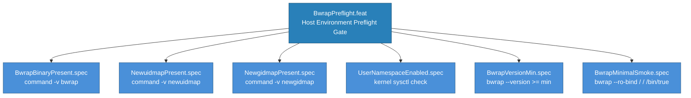

<!-- (c) 2026-* Frederick Bloom -- 20260830-025804-340827-7502-bcf6-22d32f370f3a-BwrapPreflight.feat-0.3.0.md -- Hanaden AI Loader -->
---
filename-id:   20260830-025804-340827-7502-bcf6-22d32f370f3a-BwrapPreflight.feat
node-type:     FEAT
layer:         2
version:       0.3.0
status:        Draft
priority:      1
author:        Frederick Bloom
copyright:     (c) 2026-* Frederick Bloom
description: >
  Feature: Host environment preflight gate. Verifies bwrap binary, newuidmap,
  newgidmap, user-namespace kernel support, bwrap version, and minimal smoke
  test before any CLI parsing or sandbox execution. All checks are FATAL exit 2
  with debug-level diagnostics. No CLI flag can bypass preflight.
parent:        20260830-025217-537994-7bd7-a749-cbae6033202c-BwrapRuntimePrerequisites.moti
tdd:
  state:          NOT_STARTED
  test-file:      src/test/hanaden-bwrap-enhanced/suites/BwrapPreflight.feat/test_bwrap_preflight.bats
---

# BwrapPreflight: Host Environment Preflight Gate

## Goal

Before any bwrap-enhanced.sh behavioral logic runs, the host environment MUST be
verified as capable of running bwrap sandboxes. This feature is a GATE: failure
of any preflight check blocks ALL downstream features. The gate runs before
parse_args() because a missing bwrap binary makes ALL flags meaningless.

## Requirements

| ID | Requirement | Constraint |
|----|-------------|------------|
| R1 | bwrap binary MUST be present and executable on PATH | FATAL exit 2 if absent |
| R2 | newuidmap binary MUST be present on PATH | FATAL exit 2 if absent |
| R3 | newgidmap binary MUST be present on PATH | FATAL exit 2 if absent |
| R4 | Unprivileged user namespaces MUST be enabled in kernel | FATAL exit 2 if disabled |
| R5 | bwrap version MUST meet minimum for required features | FATAL exit 2 if too old |
| R6 | Minimal sandbox smoke test MUST succeed end-to-end | FATAL exit 2 if fails |

## Feature Tree

## Sub-Features

(None -- BwrapPreflight has only spec children.)

### Spec: BwrapBinaryPresent.spec -- bwrap binary on PATH

#### Given
The host system has packages installed (or not)

#### When
bwrap-enhanced.sh starts, before parse_args()

#### Then
If `command -v bwrap` fails: [FATAL] exit 2 with message naming the missing binary
and suggesting `apt install bubblewrap` or `dnf install bubblewrap`

#### Test Data Table

| # | Input | Expected Output | f(x) Description | Box | Scope | Aspect |
|---|-------|----------------|-------------------|-----|-------|--------|
| 1 | bwrap on PATH | preflight passes, continues | Happy path: bwrap present | BLACK | Unit | Functional |
| 2 | bwrap NOT on PATH | [FATAL] exit 2, stderr contains bwrap | Unhappy: bwrap absent | BLACK | Unit | Functional |

### Spec: NewuidmapPresent.spec -- newuidmap binary on PATH

#### Given
The host system has shadow-utils/uidmap installed (or not)

#### When
bwrap-enhanced.sh starts, before parse_args()

#### Then
If `command -v newuidmap` fails: [FATAL] exit 2 with message naming the binary
and suggesting `apt install uidmap` or `dnf install shadow-utils`

#### Test Data Table

| # | Input | Expected Output | f(x) Description | Box | Scope | Aspect |
|---|-------|----------------|-------------------|-----|-------|--------|
| 1 | newuidmap on PATH | preflight passes | Happy path | BLACK | Unit | Functional |
| 2 | newuidmap NOT on PATH | [FATAL] exit 2 | Unhappy: missing | BLACK | Unit | Functional |

### Spec: NewgidmapPresent.spec -- newgidmap binary on PATH

#### Given
The host system has shadow-utils/uidmap installed (or not)

#### When
bwrap-enhanced.sh starts, before parse_args()

#### Then
If `command -v newgidmap` fails: [FATAL] exit 2 with message naming the binary

#### Test Data Table

| # | Input | Expected Output | f(x) Description | Box | Scope | Aspect |
|---|-------|----------------|-------------------|-----|-------|--------|
| 1 | newgidmap on PATH | preflight passes | Happy path | BLACK | Unit | Functional |
| 2 | newgidmap NOT on PATH | [FATAL] exit 2 | Unhappy: missing | BLACK | Unit | Functional |

### Spec: UserNamespaceEnabled.spec -- kernel supports unprivileged user ns

#### Given
A Linux host with kernel configuration

#### When
bwrap-enhanced.sh starts, before parse_args()

#### Then
If unprivileged user namespaces are disabled (sysctl
kernel.unprivileged_userns_clone=0 or /proc/sys/user/max_user_namespaces=0):
[FATAL] exit 2 with message explaining what to enable

#### Test Data Table

| # | Input | Expected Output | f(x) Description | Box | Scope | Aspect |
|---|-------|----------------|-------------------|-----|-------|--------|
| 1 | user-ns enabled | preflight passes | Happy path | BLACK | Unit | Functional |
| 2 | user-ns disabled | [FATAL] exit 2 | Unhappy: kernel denies | BLACK | Unit | Functional |

### Spec: BwrapVersionMin.spec -- bwrap version meets minimum

#### Given
bwrap binary is present but may be an old version

#### When
bwrap-enhanced.sh starts, after binary presence check

#### Then
If `bwrap --version` output indicates a version below the minimum required
for --as-pid-1 and --ro-bind-data: [FATAL] exit 2 with current and required
version numbers

#### Test Data Table

| # | Input | Expected Output | f(x) Description | Box | Scope | Aspect |
|---|-------|----------------|-------------------|-----|-------|--------|
| 1 | bwrap version sufficient | preflight passes | Happy path | BLACK | Unit | Functional |
| 2 | bwrap version too old | [FATAL] exit 2 | Unhappy: outdated | BLACK | Unit | Functional |

### Spec: BwrapMinimalSmoke.spec -- minimal sandbox launches

#### Given
All binary and kernel checks pass

#### When
bwrap-enhanced.sh runs a minimal smoke test

#### Then
`bwrap --ro-bind / / --unshare-user --die-with-parent /bin/true` succeeds.
If it fails: [FATAL] exit 2 with the bwrap stderr output for debugging
(may indicate SELinux/AppArmor policy blocking).

#### Test Data Table

| # | Input | Expected Output | f(x) Description | Box | Scope | Aspect |
|---|-------|----------------|-------------------|-----|-------|--------|
| 1 | All kernel+binary ok | smoke test passes | Happy path: end-to-end | BLACK | Integration | Functional |
| 2 | SELinux blocking | [FATAL] exit 2 with bwrap stderr | Unhappy: policy denial | BLACK | Integration | Functional |

## Test Suite

> **Suite ID:** 20260830-025804-340827-7502-bcf6-22d32f370f3a-BwrapPreflight.feat-SUITE
> **Suite name:** Host Preflight Gate Suite
> **Test file:** `src/test/hanaden-bwrap-enhanced/suites/BwrapPreflight.feat/test_bwrap_preflight.bats`

### Functional Tests

| ID | Description | Method | Pass Criteria | TDD |
|----|-------------|--------|---------------|-----|
| PF-001 | bwrap binary present | command -v bwrap | exit 0 | NOT_STARTED |
| PF-002 | newuidmap binary present | command -v newuidmap | exit 0 | NOT_STARTED |
| PF-003 | newgidmap binary present | command -v newgidmap | exit 0 | NOT_STARTED |
| PF-004 | User namespaces enabled | sysctl check | returns 1 or nonzero | NOT_STARTED |
| PF-005 | bwrap version sufficient | bwrap --version | >= minimum | NOT_STARTED |
| PF-006 | Minimal smoke test passes | bwrap --ro-bind ... /bin/true | exit 0 | NOT_STARTED |

## References

- BOOTSTRAP.md (host dependency requirements)
- bwrap-enhanced.sh (preflight check function -- to be implemented)

## Changelog

| Version | Date | Author | Changes |
|---------|------|--------|---------|
| 0.0.1 | 2026-08-18 | Frederick Bloom + AI | Initial (under NamespaceIsolatedSandbox.moti) |
| 0.3.0 | 2026-08-30 | Frederick Bloom + AI | Elevated to own DRIV branch; added version + smoke specs |
