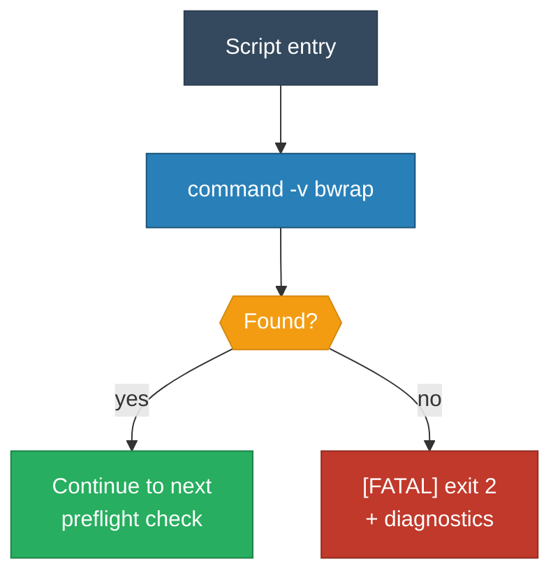

<!-- (c) 2026-* Frederick Bloom -- 20260830-025909-340065-7451-b427-e0defbdd3e66-BwrapBinaryPresent.spec-0.3.0.md -- Hanaden AI Loader -->
---
filename-id:   20260830-025909-340065-7451-b427-e0defbdd3e66-BwrapBinaryPresent.spec
node-type:     SPEC
layer:         4
version:       0.3.0
status:        Draft
author:        Frederick Bloom
copyright:     (c) 2026-* Frederick Bloom
description: >
  Specification: bwrap binary MUST be present and executable on PATH.
  Checked via command -v bwrap. FATAL exit 2 with diagnostic if absent.
  Runs before parse_args() because without bwrap, all flags are meaningless.
parent:        20260830-025804-340827-7502-bcf6-22d32f370f3a-BwrapPreflight.feat
spec-domain:   preflight
leaf-value:    binary-present
leaf-unit:     boolean
tdd:
  state:          NOT_STARTED
  test-file:      src/test/hanaden-bwrap-enhanced/suites/BwrapPreflight.feat/BwrapBinaryPresent.spec/test_bwrap_binary_present.bats
---

# BwrapBinaryPresent: bwrap binary MUST be on PATH

## Specification Statement

When bwrap-enhanced.sh starts, and before any CLI argument parsing occurs,
the script MUST execute `command -v bwrap`. If bwrap is NOT found on PATH,
the script MUST:

1. Emit `[FATAL] bwrap binary not found on PATH` to stderr
2. Emit `[DIAG]  command -v bwrap returned non-zero` to stderr
3. Emit `[HINT]  Install: apt install bubblewrap  OR  dnf install bubblewrap` to stderr
4. Exit with code 2

This check MUST run BEFORE parse_args(). Rationale: a missing bwrap binary
invalidates the entire strategy -- there is no CLI flag that can compensate.

## Rationale

- bwrap is the sole runtime dependency for namespace creation
- Without bwrap, exec_sandbox() cannot construct any argument array
- Early detection prevents cryptic "command not found" errors mid-execution
- Exit code 2 distinguishes preflight failures from CLI errors (exit 1)

## Constraints

| Constraint | Value | Rationale |
|------------|-------|-----------|
| Exit code | 2 | Preflight FATAL (distinct from CLI ERROR=1) |
| Output channel | stderr only | stdout reserved for --dry-run output |
| Check method | command -v | POSIX-portable, no external deps |
| Timing | Before parse_args() | bwrap absence invalidates ALL flags |
| Rescue flag | NONE | Cannot be bypassed by any CLI flag |

## Leaf Value

| Property | Value |
|----------|-------|
| Name | binary-present |
| Type | boolean |
| True condition | `command -v bwrap` exits 0 |
| False condition | `command -v bwrap` exits non-zero |

## Measurement Method

```bash
# Real measurement (not simulated):
if ! command -v bwrap >/dev/null 2>&1; then
    printf '[FATAL] bwrap binary not found on PATH\n' >&2
    printf '[DIAG]  command -v bwrap returned non-zero\n' >&2
    printf '[HINT]  Install: apt install bubblewrap  OR  dnf install bubblewrap\n' >&2
    exit 2
fi
```

## Behavioral Flow



## Test Suite

> **Suite ID:** 20260830-025909-340065-7451-b427-e0defbdd3e66-BwrapBinaryPresent.spec-SUITE
> **Test file:** `src/test/hanaden-bwrap-enhanced/suites/BwrapPreflight.feat/BwrapBinaryPresent.spec/test_bwrap_binary_present.bats`

### Tests

| ID | Description | Method | Pass Criteria | TDD State |
|----|-------------|--------|---------------|-----------|
| PF-BIN-001 | bwrap present: script continues past preflight | Run with bwrap on PATH | exit 0 (with valid args) | NOT_STARTED |
| PF-BIN-002 | bwrap absent: FATAL exit 2 | Remove bwrap from PATH; run script | exit 2, stderr contains FATAL and bwrap | NOT_STARTED |
| PF-BIN-003 | bwrap absent: stderr contains diagnostic | Remove bwrap from PATH; run script | stderr contains [DIAG] | NOT_STARTED |
| PF-BIN-004 | bwrap absent: stderr contains hint | Remove bwrap from PATH; run script | stderr contains [HINT] and bubblewrap | NOT_STARTED |

## Changelog

| Version | Date | Author | Changes |
|---------|------|--------|---------|
| 0.0.1 | 2026-08-18 | Frederick Bloom + AI | Initial |
| 0.3.0 | 2026-08-30 | Frederick Bloom + AI | Full spec: constraints, measurement, mermaid, test suite |
