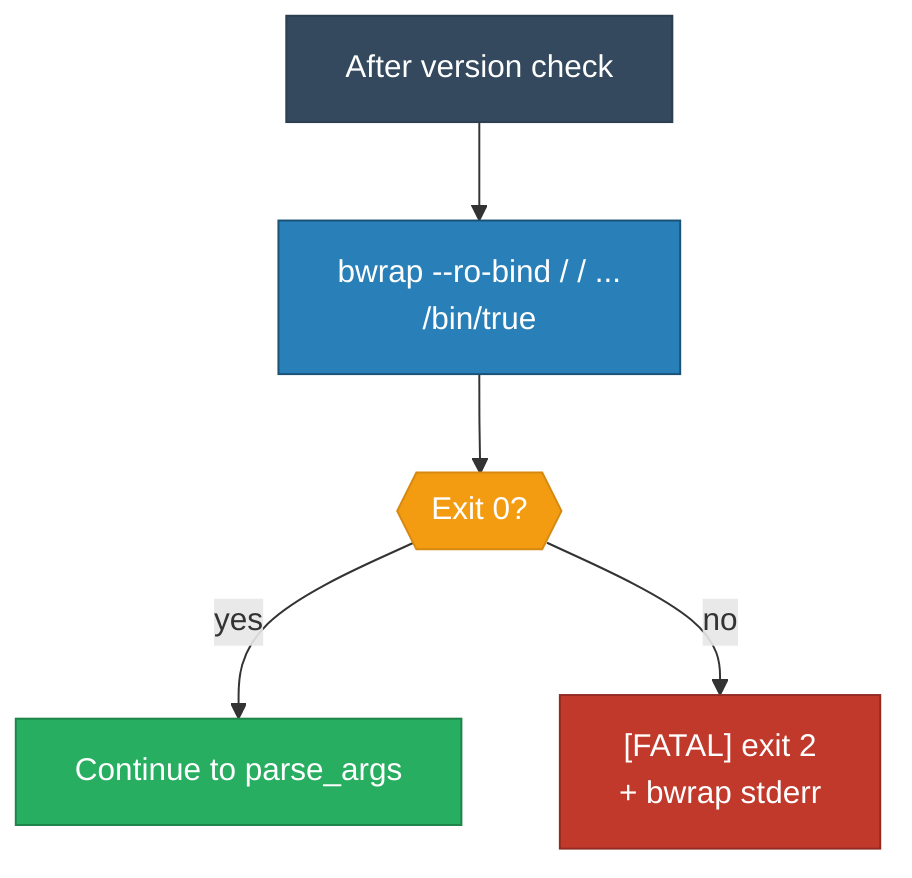

<!-- (c) 2026-* Frederick Bloom -- 20260830-031410-370698-7989-82f3-edcd51c86ef0-BwrapMinimalSmoke.spec-0.3.0.md -- Hanaden AI Loader -->
---
filename-id:   20260830-031410-370698-7989-82f3-edcd51c86ef0-BwrapMinimalSmoke.spec
node-type:     SPEC
layer:         4
version:       0.3.0
status:        Draft
author:        Frederick Bloom
copyright:     (c) 2026-* Frederick Bloom
description: >
  Specification: Minimal bwrap sandbox MUST launch successfully. A smoke test
  runs bwrap --ro-bind / / --unshare-user --die-with-parent /bin/true to verify
  the full stack (kernel + bwrap + SELinux/AppArmor). FATAL exit 2 if fails.
parent:        20260830-025804-340827-7502-bcf6-22d32f370f3a-BwrapPreflight.feat
spec-domain:   preflight
leaf-value:    smoke-pass
leaf-unit:     boolean
tdd:
  state:          RED
  test-file:      src/test/hanaden-bwrap-enhanced/suites/BwrapPreflight.feat/BwrapMinimalSmoke.spec/test_bwrap_minimal_smoke.bats
---

# BwrapMinimalSmoke: Minimal Sandbox MUST Launch

## Specification Statement

After all binary and kernel checks pass, the preflight MUST run:
`bwrap --ro-bind / / --unshare-user --die-with-parent /bin/true`

If it fails (any non-zero exit): FATAL exit 2 with bwrap stderr.
This catches SELinux/AppArmor policy denials and other runtime blockers.

## Constraints

| Constraint | Value |
|------------|-------|
| Exit code | 2 |
| Test command | bwrap --ro-bind / / --unshare-user --die-with-parent /bin/true |
| Timing | After version check, before parse_args() |

## Behavioral Flow

## Test Suite

| ID | Description | Pass Criteria | TDD |
|----|-------------|---------------|-----|
| PF-SMK-001 | bwrap smoke passes | exit != 2 | RED |
| PF-SMK-002 | bwrap smoke fails | exit 2 | RED |
| PF-SMK-003 | bwrap smoke fails | stderr contains [FATAL] | RED |

## Changelog

| Version | Date | Author | Changes |
|---------|------|--------|---------|
| 0.3.0 | 2026-08-30 | Frederick Bloom + AI | Initial |
