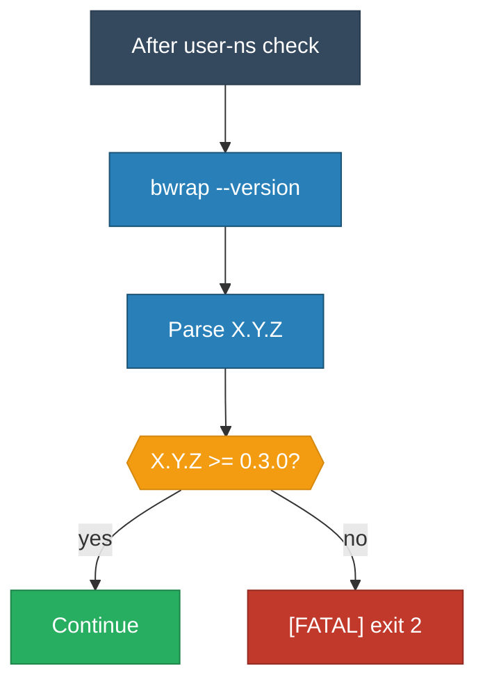

<!-- (c) 2026-* Frederick Bloom -- 20260830-031223-166710-7379-b38a-100af641d510-BwrapVersionMin.spec-0.3.0.md -- Hanaden AI Loader -->
---
filename-id:   20260830-031223-166710-7379-b38a-100af641d510-BwrapVersionMin.spec
node-type:     SPEC
layer:         4
version:       0.3.0
status:        Draft
author:        Frederick Bloom
copyright:     (c) 2026-* Frederick Bloom
description: >
  Specification: bwrap version MUST be >= 0.3.0 (required for --as-pid-1 and
  --ro-bind-data). FATAL exit 2 if version is too old.
parent:        20260830-025804-340827-7502-bcf6-22d32f370f3a-BwrapPreflight.feat
spec-domain:   preflight
leaf-value:    version-sufficient
leaf-unit:     boolean
tdd:
  state:          RED
  test-file:      src/test/hanaden-bwrap-enhanced/suites/BwrapPreflight.feat/BwrapVersionMin.spec/test_bwrap_version_min.bats
---

# BwrapVersionMin: bwrap version >= 0.3.0

## Specification Statement

During preflight, after binary presence checks, the script MUST run
`bwrap --version` and parse the version number. The minimum required
version is 0.3.0 (for --as-pid-1 and --ro-bind-data support).

If version < 0.3.0:
1. Emit `[FATAL] bwrap version X.Y.Z is below minimum 0.3.0` to stderr
2. Emit `[DIAG]  Required features: --as-pid-1, --ro-bind-data` to stderr
3. Exit with code 2

## Constraints

| Constraint | Value |
|------------|-------|
| Exit code | 2 |
| Minimum version | 0.3.0 |
| Parse method | bwrap --version, extract major.minor.patch |

## Behavioral Flow

## Test Suite

| ID | Description | Pass Criteria | TDD |
|----|-------------|---------------|-----|
| PF-VER-001 | bwrap version sufficient | exit != 2 | RED |
| PF-VER-002 | bwrap version too old | exit 2 | RED |
| PF-VER-003 | bwrap version too old | stderr contains [FATAL] | RED |

## Changelog

| Version | Date | Author | Changes |
|---------|------|--------|---------|
| 0.3.0 | 2026-08-30 | Frederick Bloom + AI | Initial |
