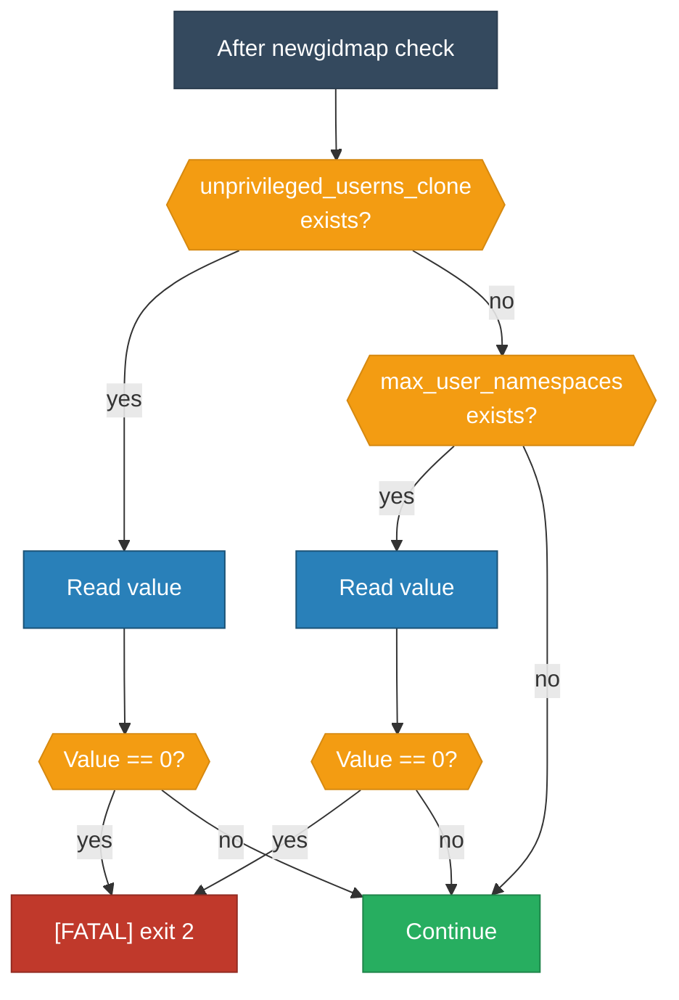

<!-- (c) 2026-* Frederick Bloom -- 20260830-031027-474183-7352-8a57-9e93d1b5cdf4-UserNamespaceEnabled.spec-0.3.0.md -- Hanaden AI Loader -->
---
filename-id:   20260830-031027-474183-7352-8a57-9e93d1b5cdf4-UserNamespaceEnabled.spec
node-type:     SPEC
layer:         4
version:       0.3.0
status:        Draft
author:        Frederick Bloom
copyright:     (c) 2026-* Frederick Bloom
description: >
  Specification: Unprivileged user namespaces MUST be enabled in the kernel.
  Checked via /proc/sys/kernel/unprivileged_userns_clone or max_user_namespaces.
  FATAL exit 2 with diagnostic if disabled.
parent:        20260830-025804-340827-7502-bcf6-22d32f370f3a-BwrapPreflight.feat
spec-domain:   preflight
leaf-value:    kernel-enabled
leaf-unit:     boolean
tdd:
  state:          RED
  test-file:      src/test/hanaden-bwrap-enhanced/suites/BwrapPreflight.feat/UserNamespaceEnabled.spec/test_user_namespace_enabled.bats
---

# UserNamespaceEnabled: Kernel MUST Support Unprivileged User Namespaces

## Specification Statement

During preflight, the script MUST verify that unprivileged user namespaces are
enabled. The check MUST use one of:
- `/proc/sys/kernel/unprivileged_userns_clone` (Debian/Ubuntu; 1 = enabled)
- `/proc/sys/user/max_user_namespaces` (Red Hat/Fedora; >0 = enabled)

If BOTH files are absent, SKIP the check (kernel may not expose these knobs).
If the value is explicitly 0: FATAL exit 2.

1. Emit `[FATAL] Unprivileged user namespaces are disabled` to stderr
2. Emit `[DIAG]  /proc/sys/kernel/unprivileged_userns_clone = 0` to stderr
3. Emit `[HINT]  Enable: sudo sysctl -w kernel.unprivileged_userns_clone=1` to stderr
4. Exit with code 2

## Constraints

| Constraint | Value |
|------------|-------|
| Exit code | 2 |
| Output channel | stderr |
| Check method | /proc/sys sysctl files |
| Timing | Before parse_args() |
| Absent proc file | SKIP (do not FATAL) |

## Behavioral Flow

## Test Suite

| ID | Description | Pass Criteria | TDD |
|----|-------------|---------------|-----|
| PF-NS-001 | user-ns enabled (file=1) | exit != 2 | RED |
| PF-NS-002 | user-ns disabled (file=0) | exit 2 | RED |
| PF-NS-003 | user-ns disabled | stderr contains [FATAL] | RED |
| PF-NS-004 | proc file absent | no FATAL (skip check) | RED |

## Changelog

| Version | Date | Author | Changes |
|---------|------|--------|---------|
| 0.3.0 | 2026-08-30 | Frederick Bloom + AI | Initial |
