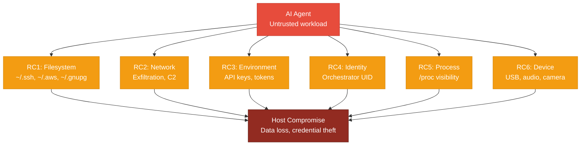

<!-- (c) 2026-* Frederick Bloom -- 20260830-025130-765220-7a8f-9338-63dc5e1dffc9-UncontainedAgentExecution.driv-0.3.0.md -- Hanaden AI Loader -->
---
filename-id:   20260830-025130-765220-7a8f-9338-63dc5e1dffc9-UncontainedAgentExecution.driv
node-type:     DRIV
layer:         1
version:       0.3.0
status:        Active
author:        Frederick Bloom
copyright:     (c) 2026-* Frederick Bloom
description: >
  Driver: Uncontained AI agent execution creates unacceptable production risk.
  Agents may generate arbitrary shell commands, touch files, consume credentials,
  exfiltrate data, or corrupt system state. Running them on bare metal or in a
  simple bash -c subshell provides zero isolation boundary.
parent:        20260830-024933-915943-7f3d-8daa-c7c4b56bcb0d-BwrapEnhanced2026.strat
---

# UncontainedAgentExecution: Uncontained AI Agents Are Dangerous

## Problem Statement

AI agents (LLMs, agentic loops, code interpreters) are fundamentally untrusted
workloads. When an orchestrator runs `bash -c "$AGENT_OUTPUT"`, the agent has:

- Full filesystem read/write access (including ~/.ssh, ~/.aws, ~/.gnupg)
- Full network access (data exfiltration, C2 callbacks, DNS tunneling)
- Full environment variable access (API keys, database URLs, tokens)
- Full process visibility (/proc introspection of other processes)
- Full identity (runs as the orchestrator UID with all its privileges)
- Full device access (/dev, USB, audio, camera)

This is not a theoretical risk. Agent-generated shell commands routinely:
- `curl` to external endpoints with piped credentials
- `rm -rf` on incorrect paths
- Read and echo secrets from environment variables
- Write to configuration files that persist across sessions
- chmod +x and execute downloaded scripts

The risk scales with agent autonomy: more powerful agents do more damage.

## Root Causes

| RC | Description | Attack Surface |
|----|-------------|----------------|
| RC1 | No filesystem isolation | Agent reads/writes host paths directly |
| RC2 | No network isolation | Agent can exfiltrate data freely via any protocol |
| RC3 | No environment isolation | Host API keys, tokens, DB URLs visible to agent |
| RC4 | No identity isolation | Agent runs as orchestrator UID with all privileges |
| RC5 | No process isolation | Agent can see/signal other processes via /proc |
| RC6 | No device isolation | Agent can access USB, audio, camera directly |

## Threat Model

## Solution

- MOTI: NamespaceIsolatedSandbox.moti -- solve via Linux user namespaces + bwrap.
  Provides read-only root, network deny by default, clean env by default,
  synthetic identity files, and composable CLI passthrough flags.
- Two independently testable ARCH subsystems:
  - CliContractEngine.arch -- parsing, validation, dry-run, qualifier rules
  - SandboxExecEngine.arch -- exec_sandbox(), VFS mount, identity, GUI

## Changelog

| Version | Date | Author | Changes |
|---------|------|--------|---------|
| 0.0.1 | 2026-08-16 | Frederick Bloom + AI | Initial |
| 0.0.1 | 2026-08-17 | Frederick Bloom + AI | Enriched with RC table |
| 0.3.0 | 2026-08-30 | Frederick Bloom + AI | Updated for v0.3.0: added RC6, threat model mermaid, two-ARCH split |
