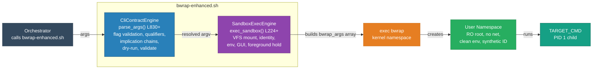

<!-- (c) 2026-* Frederick Bloom -- 20260830-025304-995277-7a65-ad8b-97b85fbd71e6-NamespaceIsolatedSandbox.moti-0.3.0.md -- Hanaden AI Loader -->
---
filename-id:   20260830-025304-995277-7a65-ad8b-97b85fbd71e6-NamespaceIsolatedSandbox.moti
node-type:     MOTI
layer:         1
version:       0.3.0
status:        Active
author:        Frederick Bloom
copyright:     (c) 2026-* Frederick Bloom
description: >
  Motivation: Solve UncontainedAgentExecution via Linux user namespaces + bwrap.
  Unprivileged user-namespace sandbox providing RO root, network isolation,
  clean env by default, synthetic identity, and composable CLI passthrough flags.
  v0.3.0 introduces two independent ARCH subsystems: CliContractEngine and
  SandboxExecEngine, testable independently.
parent:        20260830-025130-765220-7a8f-9338-63dc5e1dffc9-UncontainedAgentExecution.driv
---

# NamespaceIsolatedSandbox: User Namespace Isolation via bwrap

## Rationale

Linux user namespaces (available since kernel 3.8, enabled by default in modern
distros) allow unprivileged processes to create isolated filesystem, network,
and PID namespaces without root. Bubblewrap (bwrap) is the battle-hardened
implementation used by Flatpak and systemd. It provides a composable CLI for
building sandbox configurations.

The key insight: `bwrap --bind HOST_ROOT / --remount-ro /` creates a perfect
read-only view of the entire host system inside a namespace, with zero chance
of host mutation. Combined with `--unshare-net` and `--clearenv`, the sandbox
provides a comprehensive isolation boundary.

## Solution Architecture

## Why bwrap vs Docker/Podman

| Feature | bwrap | Docker | Podman |
|---------|-------|--------|--------|
| Requires root/daemon | No | Yes (daemon) | No (rootless) |
| Zero side effects on host | Yes | No (image layers, volumes) | No (image layers) |
| Startup latency | < 50ms | 500ms+ | 200ms+ |
| Single binary dependency | Yes | No (containerd, runc) | No (crun, conmon) |
| Composable CLI | Yes | Limited | Limited |
| OCI image required | No | Yes | Yes |
| Network isolation granularity | Per-invocation flag | Per-container | Per-container |
| Env sanitization | Per-invocation flag | Dockerfile ENV | Dockerfile ENV |

## Architecture Decomposition (v0.3.0)

Two independently testable ARCH subsystems:

### CliContractEngine.arch

All flag parsing, qualifier validation, implication chains, dry-run, validate.
Source: bwrap-enhanced.sh parse_args() at approximately L830-L987.
Testable via --dry-run and --validate without executing bwrap.

### SandboxExecEngine.arch

exec_sandbox() function: VFS mount sequence, identity injection, env
sanitization, GUI/audio/desktop passthroughs, foreground hold, namespace flags.
Source: bwrap-enhanced.sh exec_sandbox() at approximately L224-L614.
Testable with real bwrap invocation or --dry-run introspection.

## Feature Summary

| ARCH | FEATs | Specs |
|------|-------|-------|
| CliContractEngine | 24 | 134 |
| SandboxExecEngine | 23 | 139 |
| Total | 47 | 273 |

(Plus 6 specs under BwrapPreflight.feat in the HostPreflightRequirement branch,
for a grand total of 279 specs.)

## v0.3.0 Key Design Changes

| Area | v0.2.x | v0.3.0 |
|------|--------|--------|
| Architecture split | Single monolithic moti | Two independent ARCHs |
| Clean env | Opt-in --clear-env | Default (BREAKING); opt-out --env-passthrough |
| Flag naming | --enable-*, --share-net | --*-passthrough pattern |
| Qualifiers | None | Graded (ro/rw) and boolean (true/false) |
| Implication chains | None | wayland/gnome/kde imply x11 |
| CLI validation | None | --dry-run, --validate |
| Log contract | None | FATAL/ERROR/WARN/INFO/DEBUG/TRACE with exit codes |
| Preflight | FEAT under this MOTI | Elevated to own DRIV branch |

## Changelog

| Version | Date | Author | Changes |
|---------|------|--------|---------|
| 0.0.1 | 2026-08-16 | Frederick Bloom + AI | Initial |
| 0.0.1 | 2026-08-17 | Frederick Bloom + AI | Enriched: comparison table, solution mermaid |
| 0.3.0 | 2026-08-30 | Frederick Bloom + AI | Two-ARCH redesign; clean-env default; preflight split out |
