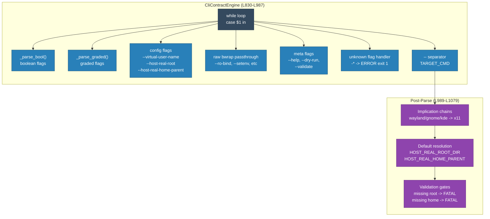
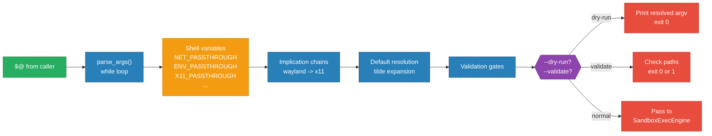

<!-- (c) 2026-* Frederick Bloom -- 20260830-025431-037349-7cc4-83d4-6063b5c1a049-CliContractEngine.arch-0.3.0.md -- Hanaden AI Loader -->
---
filename-id:   20260830-025431-037349-7cc4-83d4-6063b5c1a049-CliContractEngine.arch
node-type:     ARCH
layer:         3
version:       0.3.0
status:        Active
author:        Frederick Bloom
copyright:     (c) 2026-* Frederick Bloom
description: >
  Architecture: CLI argument parsing engine for bwrap-enhanced.sh. Handles all
  flag parsing (boolean and graded passthroughs), qualifier validation, duplicate
  detection, implication chains, --dry-run, --validate, --help, and unknown flag
  rejection. Independently testable without executing bwrap.
applies-to:    bwrap-enhanced.sh parse_args() and post-parse logic
parent:        20260830-025304-995277-7a65-ad8b-97b85fbd71e6-NamespaceIsolatedSandbox.moti
tdd:
  state:          NOT_STARTED
  test-file:      src/test/hanaden-bwrap-enhanced/suites/CliContractEngine.arch/test_cli_contract_engine.bats
---

# CliContractEngine -- Design and Specification

**Version:** 0.3.0
**Status:** Active
**Applies to:** bwrap-enhanced.sh parse_args() L830-L987 + post-parse L989-L1079

---

## 1. System Overview

The CliContractEngine is the argument-parsing subsystem of bwrap-enhanced.sh.
It is responsible for everything that happens BEFORE `exec bwrap` is called:
flag recognition, qualifier validation, default resolution, implication chain
application, conflict detection, and meta-command handling (--help, --dry-run,
--validate).

This engine is independently testable: every behavior can be verified via
--dry-run (which prints the resolved bwrap argv without executing) or by
checking exit codes and stderr output.

### 1.1 Design Goals

| Goal | Description |
|------|-------------|
| Strict validation | Every invalid input produces [ERROR] with diagnostics and exit 1 |
| No silent defaults | If a flag is ambiguous (bare graded, duplicate), reject loudly |
| Composable flags | --*-passthrough pattern; boolean (true/false) and graded (ro/rw) |
| Implication chains | wayland/gnome/kde automatically imply x11=true |
| Introspection | --dry-run and --validate let callers verify without executing |
| Zero side effects | parse_args() never touches filesystem, network, or processes |

### 1.2 Changes from v0.2.x to v0.3.0

| Area | v0.2.x | v0.3.0 |
|------|--------|--------|
| Flag names | --clear-env, --share-net, --enable-* | --*-passthrough pattern |
| Qualifiers | None | boolean (true/false) and graded (ro/rw) |
| Bare flags | Always enabled | Boolean bare=true; graded bare=ro |
| --flag false | Not handled | [ERROR] exit 1 with diagnostic |
| Duplicate flags | Silently last-wins | [ERROR] exit 1 |
| Implication chains | None | wayland/gnome/kde imply x11 |
| --dry-run | Not implemented | Resolves flags, prints argv, exit 0 |
| --validate | Not implemented | Checks paths + conflicts, exit 0 or 1 |

## 2. Architecture

### 2.1 Component Diagram



### 2.2 Data Flow



---

## 3. Lifecycle

### 3.1 Parse Sequence

1. Initialize defaults (all passthroughs = false, graded = off)
2. Enter while loop: `while [[ "$#" -gt 0 ]]`
3. For each flag, dispatch to appropriate parser:
   - Boolean flags: `_parse_bool()` -> true/false
   - Graded flags: `_parse_graded()` -> ro/rw/off
   - Config flags: validate + set variable
   - Raw bwrap: append to BWRAP_PASSTHROUGH_ARGS array
   - Meta flags: set DRY_RUN/VALIDATE_ONLY/usage
4. After loop: apply implication chains (wayland/gnome/kde -> x11)
5. Resolve defaults (HOST_REAL_ROOT_DIR, HOST_REAL_HOME_PARENT)
6. Run validation gates (missing root/home -> FATAL exit 1)
7. If --dry-run: print resolved argv, exit 0
8. If --validate: check paths + conflicts, exit 0 or 1
9. Otherwise: hand off to SandboxExecEngine

---

## 4. Flag Categories

### 4.1 Boolean Passthrough Flags

These accept `true`, `false`, or bare (defaults to `true`).

| Flag | Default | Variable |
|------|---------|----------|
| --net-passthrough | false | NET_PASSTHROUGH |
| --env-passthrough | false | ENV_PASSTHROUGH |
| --x11-passthrough | false | X11_PASSTHROUGH |
| --wayland-passthrough | false | WAYLAND_PASSTHROUGH |
| --audio-passthrough | false | AUDIO_PASSTHROUGH |
| --a11y-passthrough | false | A11Y_PASSTHROUGH |
| --dbus-passthrough | false | DBUS_PASSTHROUGH |
| --gnome-passthrough | false | GNOME_PASSTHROUGH |
| --kde-passthrough | false | KDE_PASSTHROUGH |

### 4.2 Graded Passthrough Flags

These accept `ro`, `rw`, or bare (defaults to `ro`).

| Flag | Default | Variable |
|------|---------|----------|
| --mise-passthrough | off | MISE_PASSTHROUGH |
| --local-bin-passthrough | off | LOCAL_BIN_PASSTHROUGH |

### 4.3 Configuration Flags

| Flag | Default | Variable | Tilde expansion |
|------|---------|----------|-----------------|
| --virtual-user-name | sandbox_user | VIRTUAL_USER_NAME | No |
| --host-real-root | ~/virtual-roots | HOST_REAL_ROOT_DIR | Yes |
| --host-real-home-parent | (root)/home | HOST_REAL_HOME_PARENT | Yes |

### 4.4 Raw bwrap Passthrough

| bwrap flag | Args consumed |
|------------|---------------|
| --ro-bind, --ro-bind-try, --bind, --bind-try, --dev-bind, --dev-bind-try | 3 (flag src dest) |
| --symlink | 3 (flag src dest) |
| --setenv | 3 (flag key val) |
| --unsetenv | 2 (flag key) |
| --dir | 2 (flag path) |
| --tmpfs | 2 (flag path) |

---

## 5. Function Reference

```
funct _parse_bool(flag_name, next_arg, current_value):
    CONTRACT: Parses boolean flag qualifier.
    - bare (next_arg is another flag or absent): return "true:1"
    - "true": return "true:2"
    - "false": emit [ERROR] "use of 'false' as qualifier for boolean flag"; exit 1
    - "ro"|"rw": emit [ERROR] "graded qualifier on boolean flag"; exit 1
    RETURNS: "value:shift_count"

funct _parse_graded(flag_name, next_arg, current_value):
    CONTRACT: Parses graded flag qualifier.
    - bare (next_arg is another flag or absent): return "ro:1"
    - "ro": return "ro:2"
    - "rw": return "rw:2"
    - "true"|"false": emit [ERROR] "boolean qualifier on graded flag"; exit 1
    RETURNS: "value:shift_count"

funct usage():
    CONTRACT: Prints help text listing all flags with qualifiers. exit 0.
```

---

## 6. Feature Decomposition

| Feature | Specs | Description |
|---------|-------|-------------|
| CliContract.feat | 15 | Per-flag parsing for all 11 passthrough flags + 3 config flags + help |
| QualifierRules.feat | 6 | Bare defaults, --flag false error, wrong qualifier errors, duplicate detection |
| ImplicationChain.feat | 3 | wayland/gnome/kde imply x11 |
| LogLevelContract.feat | 4 | FATAL/ERROR exit codes, debug diagnostics, stderr only, --log-level |
| ZeroSideEffects.feat | 3 | No mutation, missing root FATAL, missing home FATAL |
| DryRun.feat | 1 | --dry-run resolves and prints argv |
| Validate.feat | 1 | --validate checks paths + conflicts |
| FlagNoCmd.feat | 2 | Missing -- separator, empty TARGET_CMD |
| RawBwrapPassthrough.feat | 11 | --ro-bind, --setenv, --unsetenv, etc raw passthrough |

---

## Test Suite

> **Suite ID:** 20260830-025431-037349-7cc4-83d4-6063b5c1a049-CliContractEngine.arch-SUITE
> **Suite name:** CLI Contract Engine Architecture Suite
> **Test file:** `src/test/hanaden-bwrap-enhanced/suites/CliContractEngine.arch/test_cli_contract_engine.bats`

### Functional Tests

| ID | Description | Method | Pass Criteria | TDD |
|----|-------------|--------|---------------|-----|
| CCE-001 | All boolean flags accepted with bare | --net-passthrough -- /bin/true | exit 0 | NOT_STARTED |
| CCE-002 | All graded flags accepted with ro | --mise-passthrough ro -- /bin/true | exit 0 | NOT_STARTED |
| CCE-003 | Unknown flag rejected | --bogus-flag | exit 1, stderr contains ERROR | NOT_STARTED |
| CCE-004 | Missing -- separator rejected | /bin/true (no --) | exit 1, stderr contains ERROR | NOT_STARTED |
| CCE-005 | --dry-run prints argv | --dry-run -- /bin/true | exit 0, stdout contains bwrap | NOT_STARTED |
| CCE-006 | Implication: wayland implies x11 | --wayland-passthrough --dry-run -- /bin/true | x11 in resolved output | NOT_STARTED |

---

## References

- bwrap-enhanced.sh L830-L987 (parse_args while loop)
- bwrap-enhanced.sh L989-L1079 (post-parse: implication chains, resolution, validation)

## Changelog

| Version | Date | Author | Changes |
|---------|------|--------|---------|
| 0.3.0 | 2026-08-30 | Frederick Bloom + AI | Initial -- split from monolithic moti into independent ARCH |
