<!-- (c) 2026-* Frederick Bloom -- 20260830-031707-009843-72b5-9338-df2d3a35f4ff-CliContract.feat-0.3.0.md -- Hanaden AI Loader -->
---
filename-id:   20260830-031707-009843-72b5-9338-df2d3a35f4ff-CliContract.feat
node-type:     FEAT
layer:         2
version:       0.3.0
status:        Draft
priority:      1
author:        Frederick Bloom
copyright:     (c) 2026-* Frederick Bloom
description: >
  Feature: CLI Contract. Defines how bwrap-enhanced.sh accepts, parses, and
  validates command-line arguments. Covers flag parsing (boolean + graded),
  the -- separator, empty CMD rejection, unknown flag rejection, missing
  separator rejection, and duplicate flag rejection.
parent:        20260830-025431-037349-7cc4-83d4-6063b5c1a049-CliContractEngine.arch
tdd:
  state:          NOT_STARTED
  test-file:      src/test/hanaden-bwrap-enhanced/suites/CliContract.feat/
---

# CliContract: Command-Line Interface Contract

## Goal

Define the complete CLI contract for bwrap-enhanced.sh. Every flag, separator,
and error condition is specified with exact behavior, exit codes, and output.

## Requirements

| ID | Requirement | Exit Code |
|----|-------------|-----------|
| R1 | All flags default to safe/off values | N/A |
| R2 | `--` separates FLAGS from CMD | N/A |
| R3 | CMD after `--` is required (not empty) | ERROR exit 1 |
| R4 | Unknown flags rejected with error | ERROR exit 1 |
| R5 | Missing `--` separator rejected | ERROR exit 1 |
| R6 | Boolean flags accept true/false/toggle | N/A |
| R7 | Graded flags accept off/ro/rw | N/A |
| R8 | --dry-run mode: parse + resolve, no exec | N/A |
| R9 | --validate mode: parse + validate dirs, no exec | N/A |

## Feature Tree

```mermaid
graph TD
    FEAT["CliContract.feat<br/>CLI Contract"]:::feat

    S1["CliDefaults.spec<br/>All flags default safe"]:::spec
    S2["DoubleDashSeparator.spec<br/>-- separates flags/cmd"]:::spec
    S3["EmptyCommandFatal.spec<br/>No CMD -> exit 1"]:::spec
    S4["UnknownFlagRejection.spec<br/>-x -> exit 1"]:::spec
    S5["MissingSeparator.spec<br/>CMD without -- -> exit 1"]:::spec
    S6["BoolFlagParsing.spec<br/>true/false/toggle"]:::spec
    S7["GradedFlagParsing.spec<br/>off/ro/rw"]:::spec
    S8["DryRunMode.spec<br/>--dry-run behavior"]:::spec
    S9["ValidateMode.spec<br/>--validate behavior"]:::spec
    S10["DuplicateFlagRejection.spec<br/>repeated config flags"]:::spec

    FEAT --> S1
    FEAT --> S2
    FEAT --> S3
    FEAT --> S4
    FEAT --> S5
    FEAT --> S6
    FEAT --> S7
    FEAT --> S8
    FEAT --> S9
    FEAT --> S10

    classDef feat fill:#2980b9,stroke:#1a5276,color:#fff
    classDef spec fill:#4a90d9,stroke:#2c5f8a,color:#fff
```

## Spec Summary

### CliDefaults.spec
All flags default to their safe/off values. NET_PASSTHROUGH=false,
ENV_PASSTHROUGH=false, all boolean passthroughs=false, all graded=off,
DRY_RUN=false, VALIDATE_ONLY=false. No flags -> script proceeds to validation.

### DoubleDashSeparator.spec
The `--` token MUST be present to separate flags from CMD. Everything
after `--` is captured as TARGET_CMD array.

### EmptyCommandFatal.spec
If TARGET_CMD is empty after parse (no CMD after --): [ERROR] exit 1.
This is an ERROR not FATAL (exit 1 vs exit 2).

### UnknownFlagRejection.spec
Any flag starting with `-` that is not in the known set: [ERROR] exit 1.
Output includes the unknown flag name and a hint to use --help.

### MissingSeparator.spec
If a non-flag argument is encountered before `--`: [ERROR] exit 1.
The missing-separator message includes the argument and shows correct syntax.

### BoolFlagParsing.spec
Boolean flags accept: bare (toggle), =true, =false, true, false as next arg.
_parse_bool returns value:shift_count format.

### GradedFlagParsing.spec
Graded flags accept: bare (toggle off->ro->rw->off), =off, =ro, =rw.
_parse_graded returns value:shift_count format.

### DryRunMode.spec
--dry-run: Parse and resolve all flags, print the resolved bwrap command
to stdout, exit 0. No bwrap exec. No directory validation.

### ValidateMode.spec
--validate: Parse flags, validate all directories exist, print resolved
config, exit 0. No bwrap exec.

### DuplicateFlagRejection.spec
Configuration flags (--virtual-user-name, --host-real-root,
--host-real-home-parent) MUST reject duplicate specification: [ERROR] exit 1.

## Test Suite

> **Suite ID:** 20260830-031707-009843-72b5-9338-df2d3a35f4ff-CliContract.feat-SUITE
> **Suite name:** CLI Contract Suite

## Changelog

| Version | Date | Author | Changes |
|---------|------|--------|---------|
| 0.3.0 | 2026-08-30 | Frederick Bloom + AI | Initial full spec |
