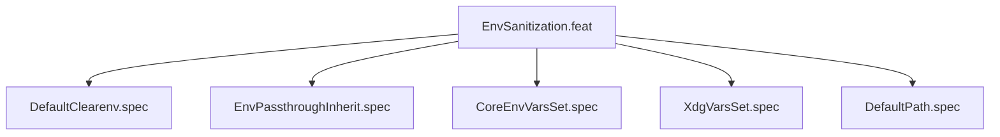

# EnvSanitization

## Goal

Environment sanitization: clean env default, variable injection.
v0.3.0 BREAKING CHANGE: --clearenv is now the default (was opt-in).

## Feature Tree

## Specifications

| Spec | Given | When | Then |
|------|-------|------|------|
| DefaultClearenv | No --env-passthrough | dry-run | --clearenv present |
| EnvPassthroughInherit | --env-passthrough | dry-run | --clearenv absent |
| CoreEnvVarsSet | Default config | dry-run | HOME and USER --setenv present |
| XdgVarsSet | Default config | dry-run | XDG_DATA_HOME and XDG_STATE_HOME set |
| DefaultPath | Default config | dry-run | PATH=/usr/bin:/bin |

## Test Suite

All tests in `src/test/hanaden-bwrap-enhanced/suites/EnvSanitization.feat/` -- bats-core.

## Changelog

| Version | Date | Author | Changes |
|---------|------|--------|---------|
| 0.3.0 | 2026-08-30 | Frederick Bloom + AI | Initial with mermaid, GWT, full template |
