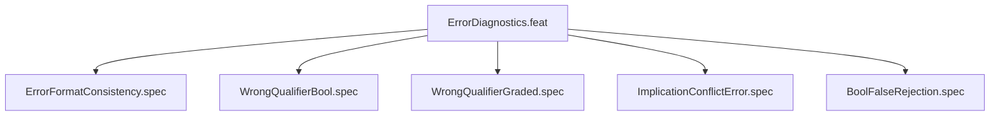

# ErrorDiagnostics

## Goal

Structured error output format ([ERROR]/[DIAG]/[HINT])

## Feature Tree

## Specifications

| Spec | Given | When | Then |
|------|-------|------|------|
| ErrorFormatConsistency | Given sandbox configured | When dry-run | Then ErrorFormatConsistency verified |
| WrongQualifierBool | Given sandbox configured | When dry-run | Then WrongQualifierBool verified |
| WrongQualifierGraded | Given sandbox configured | When dry-run | Then WrongQualifierGraded verified |
| ImplicationConflictError | Given sandbox configured | When dry-run | Then ImplicationConflictError verified |
| BoolFalseRejection | Given sandbox configured | When dry-run | Then BoolFalseRejection verified |

## Test Suite

All tests in `src/test/hanaden-bwrap-enhanced/suites/ErrorDiagnostics.feat/` -- bats-core.

## Changelog

| Version | Date | Author | Changes |
|---------|------|--------|---------|
| 0.3.0 | 2026-08-30 | Frederick Bloom + AI | Initial with mermaid, GWT, full template |
