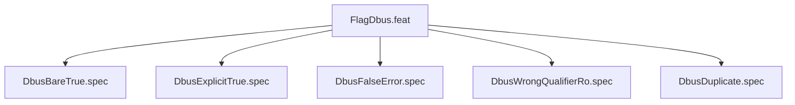

# FlagDbus

## Goal
Verify --dbus-passthrough parsing: bare=true, explicit true=true, false=ERROR, wrong qualifier=ERROR, duplicate=ERROR.

## Feature Tree

## Specifications
| Spec | Given | When | Then |
|------|-------|------|------|
| DbusBareTrue | --dbus-passthrough bare | dry-run | dbus binds present |
| DbusExplicitTrue | --dbus-passthrough true | dry-run | dbus binds present |
| DbusFalseError | --dbus-passthrough false | run | [ERROR] exit 1 |
| DbusWrongQualifierRo | --dbus-passthrough ro | run | [ERROR] exit 1 |
| DbusDuplicate | --dbus-passthrough twice | run | [ERROR] exit 1 |

## Changelog
| Version | Date | Author | Changes |
|---------|------|--------|---------|
| 0.3.0 | 2026-08-30 | Frederick Bloom + AI | Initial |
