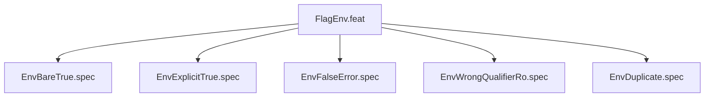

# FlagEnv

## Goal
Verify --env-passthrough parsing: bare=true, explicit true=true, false=ERROR, wrong qualifier=ERROR, duplicate=ERROR.

## Feature Tree

## Specifications
| Spec | Given | When | Then |
|------|-------|------|------|
| EnvBareTrue | --env-passthrough bare | dry-run | no --clearenv |
| EnvExplicitTrue | --env-passthrough true | dry-run | no --clearenv |
| EnvFalseError | --env-passthrough false | run | [ERROR] exit 1 |
| EnvWrongQualifierRo | --env-passthrough ro | run | [ERROR] exit 1 |
| EnvDuplicate | --env-passthrough twice | run | [ERROR] exit 1 |

## Changelog
| Version | Date | Author | Changes |
|---------|------|--------|---------|
| 0.3.0 | 2026-08-30 | Frederick Bloom + AI | Initial |
