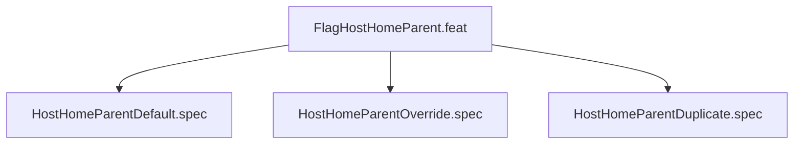

# FlagHostHomeParent
## Goal
Verify --host-real-home-parent: default derived from root/home, override, dup error.

```mermaid
graph TD
    F["FlagHostHomeParent.feat"]
    D["HostHomeParentDefault.spec"]
    O["HostHomeParentOverride.spec"]
    DP["HostHomeParentDuplicate.spec"]
    F --> D & O & DP
```
