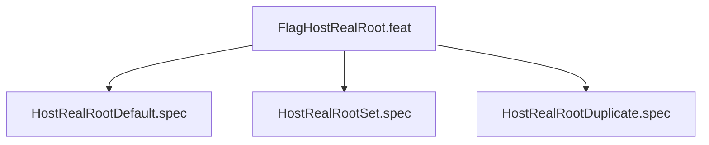

# FlagHostRealRoot
## Goal
Verify --host-real-root: default ~/virtual-roots, explicit PATH, dup error.

## Changelog
| Version | Date | Author | Changes |
|---------|------|--------|---------|
| 0.3.0 | 2026-08-30 | Frederick Bloom + AI | Initial |
