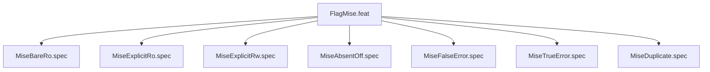

# FlagMise

## Goal
Verify --mise-passthrough parsing: bare=ro, explicit-ro, explicit-rw, absent=off, false=ERROR, true=ERROR, dup=ERROR.

## Feature Tree

## Changelog
| Version | Date | Author | Changes |
|---------|------|--------|---------|
| 0.3.0 | 2026-08-30 | Frederick Bloom + AI | Initial |
