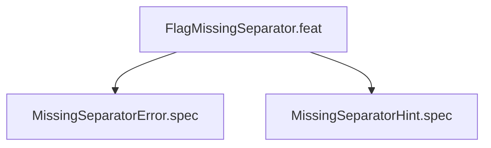

# FlagMissingSeparator
## Goal
Missing -- separator

```mermaid
graph TD
    F["FlagMissingSeparator.feat"]
    F --> MissingSeparatorError["MissingSeparatorError.spec"]
    F --> MissingSeparatorHint["MissingSeparatorHint.spec"]
```
