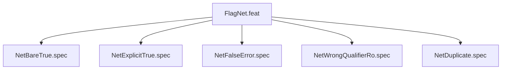

# FlagNet

## Goal
Verify --net-passthrough parsing: bare=true, explicit true=true, false=ERROR, wrong qualifier=ERROR, duplicate=ERROR.

## Feature Tree

## Specifications
| Spec | Given | When | Then |
|------|-------|------|------|
| NetBareTrue | --net-passthrough bare | dry-run | no --unshare-net |
| NetExplicitTrue | --net-passthrough true | dry-run | no --unshare-net |
| NetFalseError | --net-passthrough false | run | [ERROR] exit 1 |
| NetWrongQualifierRo | --net-passthrough ro | run | [ERROR] exit 1 |
| NetDuplicate | --net-passthrough twice | run | [ERROR] exit 1 |

## Changelog
| Version | Date | Author | Changes |
|---------|------|--------|---------|
| 0.3.0 | 2026-08-30 | Frederick Bloom + AI | Initial |
