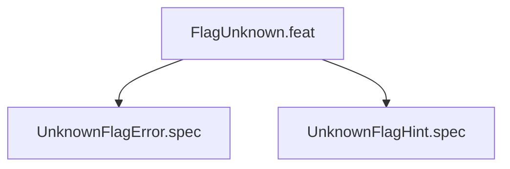

# FlagUnknown
## Goal
Unknown flag rejection

```mermaid
graph TD
    F["FlagUnknown.feat"]
    F --> UnknownFlagError["UnknownFlagError.spec"]
    F --> UnknownFlagHint["UnknownFlagHint.spec"]
```
