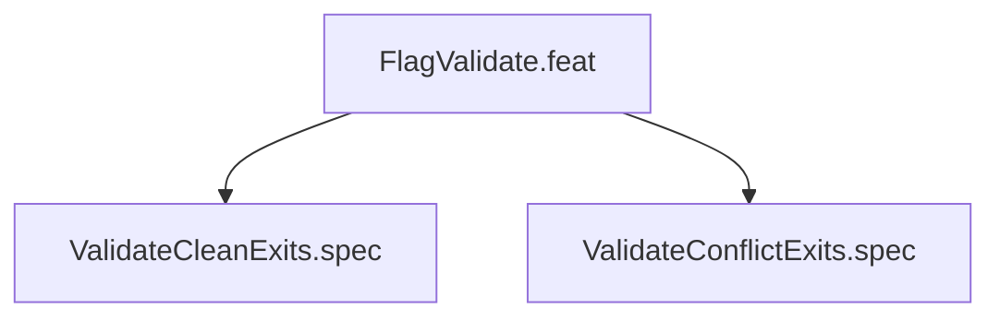

# FlagValidate
## Goal
--validate flag FEAT

```mermaid
graph TD
    F["FlagValidate.feat"]
    F --> ValidateCleanExits["ValidateCleanExits.spec"]
    F --> ValidateConflictExits["ValidateConflictExits.spec"]
```
