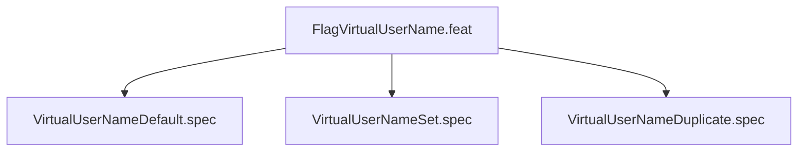

# FlagVirtualUserName
## Goal
Verify --virtual-user-name: default sandbox_user, explicit set, dup error.

## Changelog
| Version | Date | Author | Changes |
|---------|------|--------|---------|
| 0.3.0 | 2026-08-30 | Frederick Bloom + AI | Initial |
