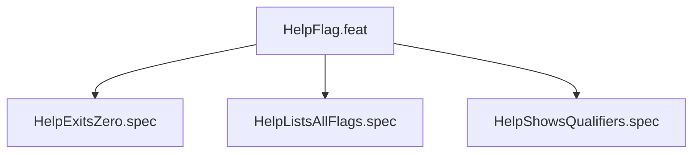

# HelpFlag

## Goal
The --help flag is the single source of truth for CLI contract.

## Specs
- HelpExitsZero: --help exits 0
- HelpListsAllFlags: all 17 flags present in output
- HelpShowsQualifiers: each flag shows its qualifier type

## Changelog

| Version | Date | Author | Changes |
|---------|------|--------|---------|
| 0.3.0 | 2026-08-30 | Frederick Bloom + AI | Initial |
