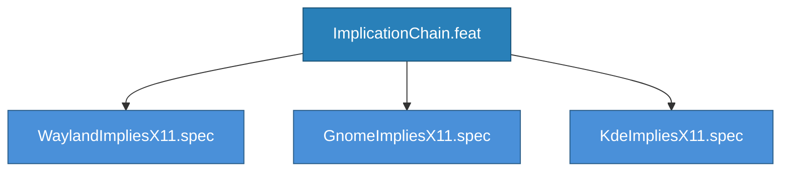

<!-- (c) 2026-* Frederick Bloom -- ImplicationChain.feat -- Hanaden AI Loader -->
---
filename-id:   20260830-032702-668601-7965-b778-b230b051fe8b-ImplicationChain.feat
node-type:     FEAT
layer:         2
version:       0.3.0
status:        Draft
author:        Frederick Bloom
copyright:     (c) 2026-* Frederick Bloom
description: >
  Feature: Post-parse implication chains. wayland -> x11, gnome -> x11,
  kde -> x11. These activate X11 passthrough when display server passthroughs
  are enabled (for XWayland compatibility).
parent:        20260830-025431-037349-7cc4-83d4-6063b5c1a049-CliContractEngine.arch
tdd:
  state:          GREEN
  test-file:      src/test/hanaden-bwrap-enhanced/suites/ImplicationChain.feat/
---

# ImplicationChain: Post-Parse Flag Implications

## Goal

After all flags are parsed, apply implication chains:
- `--wayland-passthrough true` -> `X11_PASSTHROUGH=true`
- `--gnome-passthrough true` -> `X11_PASSTHROUGH=true`
- `--kde-passthrough true` -> `X11_PASSTHROUGH=true`

This ensures XWayland compatibility -- display server passthroughs imply X11.

## Feature Tree

## Changelog

| Version | Date | Author | Changes |
|---------|------|--------|---------|
| 0.3.0 | 2026-08-30 | Frederick Bloom + AI | Initial |
