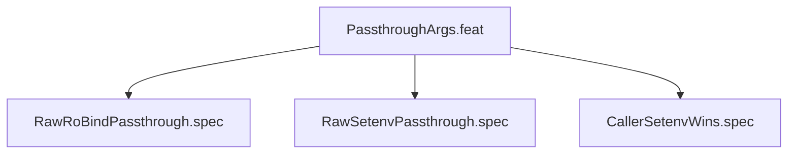

# PassthroughArgs

## Goal

Raw bwrap passthrough arguments (--ro-bind, --setenv, etc)

## Feature Tree

## Specifications

| Spec | Given | When | Then |
|------|-------|------|------|
| RawRoBindPassthrough | Given sandbox configured | When dry-run | Then RawRoBindPassthrough verified |
| RawSetenvPassthrough | Given sandbox configured | When dry-run | Then RawSetenvPassthrough verified |
| CallerSetenvWins | Given sandbox configured | When dry-run | Then CallerSetenvWins verified |

## Test Suite

All tests in `src/test/hanaden-bwrap-enhanced/suites/PassthroughArgs.feat/` -- bats-core.

## Changelog

| Version | Date | Author | Changes |
|---------|------|--------|---------|
| 0.3.0 | 2026-08-30 | Frederick Bloom + AI | Initial with mermaid, GWT, full template |
