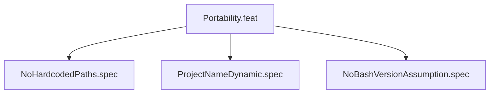

# Portability

## Goal
Script must be portable across Linux hosts with no hardcoded paths.

## Specs
- NoHardcodedPaths: no /homes/ or absolute user paths in script
- ProjectNameDynamic: PROJECT_NAME derived from basename pwd
- NoBashVersionAssumption: no bash 5 features used

## Changelog

| Version | Date | Author | Changes |
|---------|------|--------|---------|
| 0.3.0 | 2026-08-30 | Frederick Bloom + AI | Initial |
