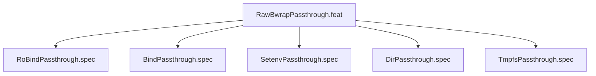

# RawBwrapPassthrough

## Goal
Verify that raw bwrap flags are accepted and stored in BWRAP_PASSTHROUGH_ARGS.

## Feature Tree

## Changelog
| Version | Date | Author | Changes |
|---------|------|--------|---------|
| 0.3.0 | 2026-08-30 | Frederick Bloom + AI | Initial |
