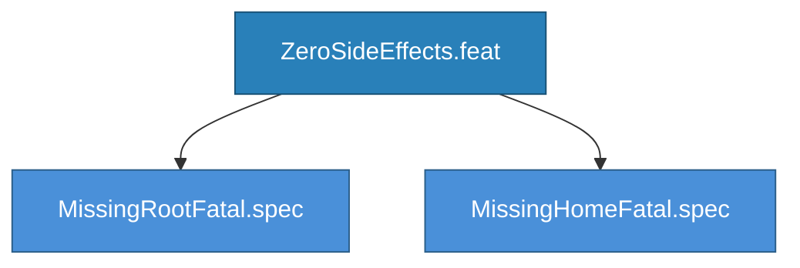

<!-- (c) 2026-* Frederick Bloom -- ZeroSideEffects.feat -- Hanaden AI Loader -->
---
filename-id:   20260830-032925-837992-7df8-8101-ad77de7cf588-ZeroSideEffects.feat
node-type:     FEAT
layer:         2
version:       0.3.0
status:        Draft
author:        Frederick Bloom
copyright:     (c) 2026-* Frederick Bloom
description: >
  Feature: Zero Side Effects. The script MUST NOT create, modify, or delete
  any files or directories on the host. If required paths are missing, it
  exits with an error and a hint showing how to create them manually.
parent:        20260830-025431-037349-7cc4-83d4-6063b5c1a049-CliContractEngine.arch
tdd:
  state:          GREEN
  test-file:      src/test/hanaden-bwrap-enhanced/suites/ZeroSideEffects.feat/
---

# ZeroSideEffects: Script MUST NOT Modify Host Filesystem

## Specs

### MissingRootFatal.spec
If --host-real-root path does not exist: [ERROR] exit 1 with mkdir hint.

### MissingHomeFatal.spec
If sandbox home dir does not exist: [ERROR] exit 1 with mkdir hint.

## Feature Tree

## Changelog

| Version | Date | Author | Changes |
|---------|------|--------|---------|
| 0.3.0 | 2026-08-30 | Frederick Bloom + AI | Initial |
