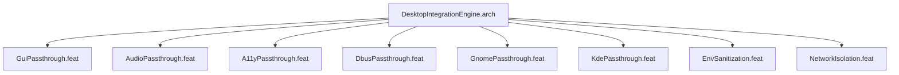

# DesktopIntegrationEngine

## Purpose
Manages desktop environment passthrough: X11, Wayland, audio (PipeWire/Pulse),
accessibility (AT-SPI), D-Bus session bus, GNOME services, KDE services,
environment sanitization, and network isolation.

## Feature Tree

## Changelog

| Version | Date | Author | Changes |
|---------|------|--------|---------|
| 0.3.0 | 2026-08-30 | Frederick Bloom + AI | Initial |
