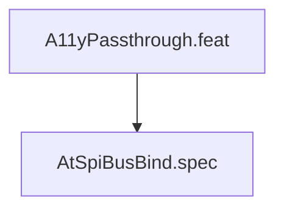

# A11yPassthrough

## Goal

Bind AT-SPI accessibility bus into sandbox

## Feature Tree

## Specifications

| Spec | Given | When | Then |
|------|-------|------|------|
| AtSpiBusBind | Given sandbox configured | When dry-run | Then AtSpiBusBind verified |

## Test Suite

All tests in `src/test/hanaden-bwrap-enhanced/suites/A11yPassthrough.feat/` -- bats-core.

## Changelog

| Version | Date | Author | Changes |
|---------|------|--------|---------|
| 0.3.0 | 2026-08-30 | Frederick Bloom + AI | Initial with mermaid, GWT, full template |
