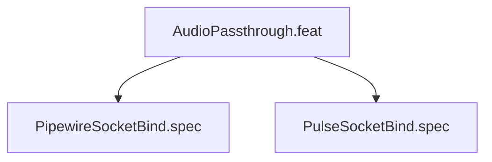

# AudioPassthrough

## Goal

Bind PipeWire and PulseAudio sockets into sandbox

## Feature Tree

## Specifications

| Spec | Given | When | Then |
|------|-------|------|------|
| PipewireSocketBind | Given sandbox configured | When dry-run | Then PipewireSocketBind verified |
| PulseSocketBind | Given sandbox configured | When dry-run | Then PulseSocketBind verified |

## Test Suite

All tests in `src/test/hanaden-bwrap-enhanced/suites/AudioPassthrough.feat/` -- bats-core.

## Changelog

| Version | Date | Author | Changes |
|---------|------|--------|---------|
| 0.3.0 | 2026-08-30 | Frederick Bloom + AI | Initial with mermaid, GWT, full template |
