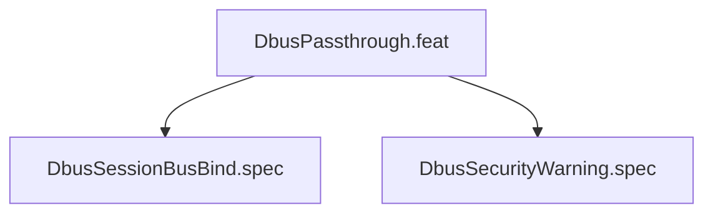

# DbusPassthrough

## Goal

Bind D-Bus session bus with security warning

## Feature Tree

## Specifications

| Spec | Given | When | Then |
|------|-------|------|------|
| DbusSessionBusBind | Given sandbox configured | When dry-run | Then DbusSessionBusBind verified |
| DbusSecurityWarning | Given sandbox configured | When dry-run | Then DbusSecurityWarning verified |

## Test Suite

All tests in `src/test/hanaden-bwrap-enhanced/suites/DbusPassthrough.feat/` -- bats-core.

## Changelog

| Version | Date | Author | Changes |
|---------|------|--------|---------|
| 0.3.0 | 2026-08-30 | Frederick Bloom + AI | Initial with mermaid, GWT, full template |
