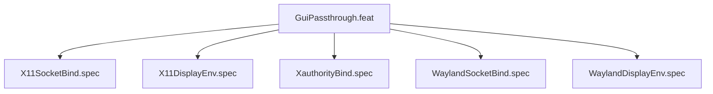

# GuiPassthrough

## Goal

Bind X11 and Wayland display sockets into sandbox

## Feature Tree

## Specifications

| Spec | Given | When | Then |
|------|-------|------|------|
| X11SocketBind | Given sandbox configured | When dry-run | Then X11SocketBind verified |
| X11DisplayEnv | Given sandbox configured | When dry-run | Then X11DisplayEnv verified |
| XauthorityBind | Given sandbox configured | When dry-run | Then XauthorityBind verified |
| WaylandSocketBind | Given sandbox configured | When dry-run | Then WaylandSocketBind verified |
| WaylandDisplayEnv | Given sandbox configured | When dry-run | Then WaylandDisplayEnv verified |

## Test Suite

All tests in `src/test/hanaden-bwrap-enhanced/suites/GuiPassthrough.feat/` -- bats-core.

## Changelog

| Version | Date | Author | Changes |
|---------|------|--------|---------|
| 0.3.0 | 2026-08-30 | Frederick Bloom + AI | Initial with mermaid, GWT, full template |
