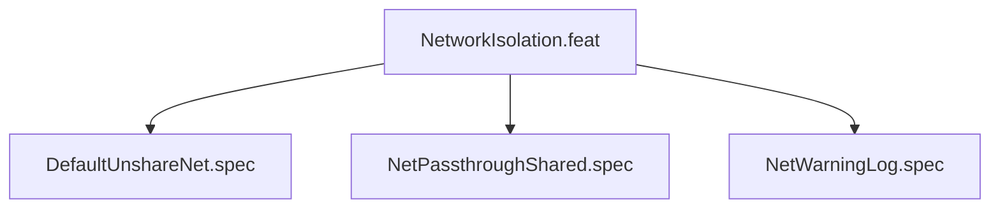

# NetworkIsolation

## Goal

Network is isolated by default (--unshare-net). Opt-in via --net-passthrough
shares host network namespace with a security warning.

## Feature Tree

## Specifications

| Spec | Given | When | Then |
|------|-------|------|------|
| DefaultUnshareNet | No flags | dry-run | --unshare-net present |
| NetPassthroughShared | --net-passthrough | dry-run | --unshare-net absent |
| NetWarningLog | --net-passthrough | dry-run | SYS-LOG WARNING emitted |

## Test Suite

All tests in `src/test/hanaden-bwrap-enhanced/suites/NetworkIsolation.feat/` -- bats-core.

## Changelog

| Version | Date | Author | Changes |
|---------|------|--------|---------|
| 0.3.0 | 2026-08-30 | Frederick Bloom + AI | Initial with mermaid, GWT, full template |
