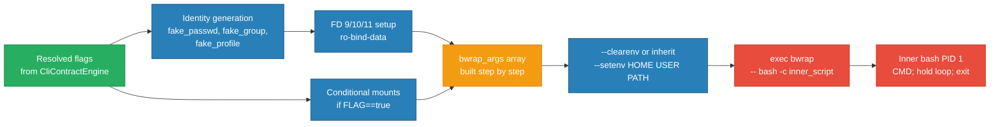

<!-- (c) 2026-* Frederick Bloom -- 20260830-025553-521140-750e-9be6-9fecab58b4bc-SandboxExecEngine.arch-0.3.0.md -- Hanaden AI Loader -->
---
filename-id:   20260830-025553-521140-750e-9be6-9fecab58b4bc-SandboxExecEngine.arch
node-type:     ARCH
layer:         3
version:       0.3.0
status:        Active
author:        Frederick Bloom
copyright:     (c) 2026-* Frederick Bloom
description: >
  Architecture: Sandbox execution engine for bwrap-enhanced.sh. Handles VFS
  mount sequence (12 steps), identity injection (synthetic passwd/group via FD),
  environment sanitization (clean env default), GUI/audio/desktop passthroughs,
  mise/local-bin toolchain binding, foreground hold loop, and namespace flags.
  This engine executes AFTER CliContractEngine resolves all flags.
applies-to:    bwrap-enhanced.sh exec_sandbox() L224-L614
parent:        20260830-025304-995277-7a65-ad8b-97b85fbd71e6-NamespaceIsolatedSandbox.moti
tdd:
  state:          NOT_STARTED
  test-file:      src/test/hanaden-bwrap-enhanced/suites/SandboxExecEngine.arch/test_sandbox_exec_engine.bats
---

# SandboxExecEngine -- Design and Specification

**Version:** 0.3.0
**Status:** Active
**Applies to:** bwrap-enhanced.sh exec_sandbox() L224-L614

---

## 1. System Overview

The SandboxExecEngine is the execution subsystem of bwrap-enhanced.sh. It
receives resolved flag values from CliContractEngine and constructs the bwrap
argument array, generates synthetic identity files, configures environment
variables, and executes `bwrap` with the constructed arguments.

Unlike CliContractEngine (which is pure parsing), this engine interacts with:
- The filesystem (checking paths, reading /etc/passwd)
- The kernel (creating namespaces via bwrap)
- File descriptors (FD 9/10/11 for identity injection)
- Processes (foreground hold loop, orphan reaping)

### 1.1 Design Goals

| Goal | Description |
|------|-------------|
| 12-step VFS mount | Deterministic mount sequence from virtual-root to RO root lock |
| Identity isolation | Synthetic passwd/group/profile via FD injection, never host files |
| Clean env default | --clearenv is default in v0.3.0 (BREAKING); opt-out via --env-passthrough |
| GUI composability | Each GUI subsystem (wayland, x11, audio, a11y, dbus, gnome, kde) independent |
| Foreground hold | PID 1 inner bash holds namespace alive until all orphans exit |
| Exit code fidelity | CMD exit code propagated exactly through hold loop to caller |

## 2. Architecture

### 2.1 Component Diagram

```mermaid
graph TB
    subgraph "exec_sandbox() L224-L614"
        INIT["Initialize<br/>realpath, _RU"]:::init

        subgraph "Identity Injection L247-L263"
            PASSWD["fake_passwd<br/>system + virtual user"]:::id
            GROUP["fake_group<br/>system groups + virtual"]:::id
            PROFILE["fake_profile<br/>PATH=/usr/bin:/bin"]:::id
        end

        subgraph "VFS Mount Sequence L265-L350"
            S1["Step 1: Virtual root --bind"]:::vfs
            S2["Step 2: usr-merge --ro-bind /usr"]:::vfs
            S3["Step 3: /etc essentials --ro-bind-try"]:::vfs
            S4["Step 4: Kernel FS --proc --dev-bind"]:::vfs
            S5["Step 5: Ephemeral tmpfs /dev/shm /tmp"]:::vfs
            S6["Step 6: /run dbus + user tmpfs"]:::vfs
            S8["Step 8: Home overlay tmpfs"]:::vfs
            S9["Step 9: Egress write-hole --bind"]:::vfs
        end

        subgraph "Conditional Passthroughs L352-L530"
            S7A["Step 7a: Wayland sockets"]:::gui
            S7B["Step 7b: Audio PipeWire+Pulse"]:::gui
            S7C["Step 7c: A11y AT-SPI"]:::gui
            S7D["Step 7d: D-Bus session bus"]:::gui
            S7E["Step 7e: GNOME sockets"]:::gui
            S7F["Step 7f: KDE sockets"]:::gui
            S9A["Step 9a: local-bin"]:::gui
            S9B["Step 9b: mise"]:::gui
        end

        subgraph "Finalize L530-L614"
            ROLOCK["Step 11: --remount-ro /"]:::lock
            EGRESS2["Step 12: Egress re-bind after lock"]:::lock
            ENV["Environment setup<br/>--clearenv or inherit"]:::env
            EXEC["exec bwrap with inner bash"]:::exec
            HOLD["Foreground hold loop<br/>orphan reap + exit code"]:::exec
        end
    end

    INIT --> PASSWD
    INIT --> GROUP
    INIT --> PROFILE
    PASSWD --> S1
    S1 --> S2 --> S3 --> S4 --> S5 --> S6 --> S8 --> S9
    S9 --> S7A --> S7B --> S7C --> S7D --> S7E --> S7F --> S9A --> S9B
    S9B --> ROLOCK --> EGRESS2 --> ENV --> EXEC --> HOLD

    classDef init fill:#34495e,stroke:#2c3e50,color:#fff
    classDef id   fill:#16a085,stroke:#0e6655,color:#fff
    classDef vfs  fill:#2980b9,stroke:#1a5276,color:#fff
    classDef gui  fill:#8e44ad,stroke:#6c3483,color:#fff
    classDef lock fill:#c0392b,stroke:#922b21,color:#fff
    classDef env  fill:#f39c12,stroke:#d68910,color:#fff
    classDef exec fill:#27ae60,stroke:#1e8449,color:#fff
```



### 2.2 Data Flow



---

## 3. VFS Mount Sequence

The 12-step mount sequence is deterministic and order-dependent. Each step
builds on the previous one. The sequence is:

| Step | Operation | Source | Dest | Type |
|------|-----------|--------|------|------|
| 1 | Virtual root | HOST_REAL_ROOT_DIR | / | --bind (rw initially) |
| 2 | usr-merge | /usr + symlinks | /usr, /bin, /lib, /lib64 | --ro-bind + --symlink |
| 3 | /etc essentials | /etc/* selective | /etc/* | --ro-bind-try |
| 4 | Kernel FS | /proc, /dev | /proc, /dev | --proc, --dev-bind |
| 5 | Ephemeral tmpfs | (new) | /dev/shm, /tmp | --tmpfs |
| 6 | /run setup | /run/dbus | /run/dbus, /run/user/UID | --bind-try, --tmpfs |
| 7a-7f | GUI passthroughs | host sockets | sandbox sockets | conditional |
| 8 | Home overlay | (new) | /home | --tmpfs + --dir |
| 9 | Egress write-hole | HOST home | /home/VUSER | --bind (before lock) |
| 10 | Identity FD inject | generated | /etc/passwd,group,profile | --ro-bind-data FD |
| 11 | RO root lock | / | / | --remount-ro |
| 12 | Egress re-bind | HOST home | /home/VUSER | --bind (after lock) |

---

## 4. Identity Injection

Synthetic identity files prevent the sandbox from inheriting host user
information while maintaining compatibility with tools that read /etc/passwd.

| File | Content | FD |
|------|---------|-----|
| /etc/passwd | System accounts (UID<1000) + virtual user + nobody | FD 9 |
| /etc/group | System groups (GID<1000) + virtual user group | FD 10 |
| /etc/profile | PATH=/usr/bin:/bin only; prevents host profile.d contamination | FD 11 |

---

## 5. Feature Decomposition

| Feature | Specs | Description |
|---------|-------|-------------|
| VfsIsolation.feat | 9 | 12-step mount sequence |
| EnvSanitization.feat | 3 | Clean env default, env-passthrough, XDG vars |
| IdentityInjection.feat | 5 | passwd/group/profile generation + FD inject |
| NetworkIsolation.feat | 2 | Network deny default, net-passthrough opt-in |
| GuiPassthrough.feat | 11 | wayland/x11/audio/a11y/dbus/gnome/kde + themes/fonts/browser |
| MisePassthrough.feat | 5 | mise binary + data/config/cache dirs + PATH |
| LocalBinPassthrough.feat | 1 | host ~/.local/bin binding |
| ForegroundHold.feat | 4 | Sync exec, builtin loop, exit code, orphan reap |
| HostCoupledDev.feat | 2 | Portable project structure |
| VirtualEnvSetup.feat | 3 | Project name, OS skeleton, sandbox user home |
| PassthroughArgs.feat | 4 | Raw bwrap --ro-bind/--setenv/etc passthrough |

---

## 6. Function Reference

```
funct exec_sandbox(env_passthrough, virtual_user_name, mounted_new_root_dir, mounted_home_dir, ...command):
    CONTRACT:
    - Preconditions: All flag variables resolved by CliContractEngine
    - Preconditions: mounted_new_root_dir exists as directory
    - Preconditions: mounted_home_dir exists as directory
    - Side effects: Creates namespace via bwrap, executes CMD in sandbox
    - Returns: Exit code of CMD (propagated through hold loop)
    - On error: [FATAL] exit 1 for missing paths; bwrap errors propagated
```

---

## Test Suite

> **Suite ID:** 20260830-025553-521140-750e-9be6-9fecab58b4bc-SandboxExecEngine.arch-SUITE
> **Suite name:** Sandbox Exec Engine Architecture Suite
> **Test file:** `src/test/hanaden-bwrap-enhanced/suites/SandboxExecEngine.arch/test_sandbox_exec_engine.bats`

### Functional Tests

| ID | Description | Method | Pass Criteria | TDD |
|----|-------------|--------|---------------|-----|
| SEE-001 | VFS mount produces RO root | exec sandbox; touch /etc/test | touch fails (RO) | NOT_STARTED |
| SEE-002 | Identity injection: virtual user in passwd | exec sandbox; whoami | returns virtual_user_name | NOT_STARTED |
| SEE-003 | Clean env default: HOST vars absent | exec sandbox; env | no host env vars present | NOT_STARTED |
| SEE-004 | Egress write-hole: home is writable | exec sandbox; touch ~/test | touch succeeds | NOT_STARTED |
| SEE-005 | Exit code preserved | exec sandbox; exit 42 | $? == 42 | NOT_STARTED |
| SEE-006 | Network deny default | exec sandbox; curl | curl fails (no network) | NOT_STARTED |

---

## References

- bwrap-enhanced.sh L224-L614 (exec_sandbox function)
- bwrap-enhanced.sh L1000-L1079 (post-parse validation and exec call)

## Changelog

| Version | Date | Author | Changes |
|---------|------|--------|---------|
| 0.0.1 | 2026-08-16 | Frederick Bloom + AI | Initial (as SandboxExecEngine.arch under moti) |
| 0.3.0 | 2026-08-30 | Frederick Bloom + AI | Full redesign: 12-step VFS, identity FD inject, clean-env default |
