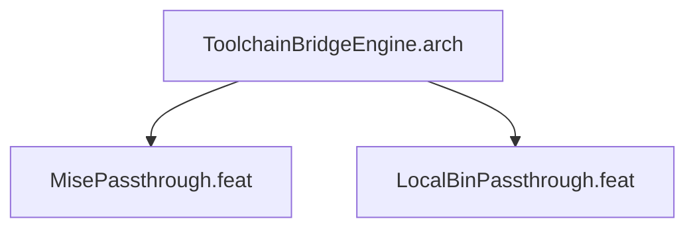

# ToolchainBridgeEngine

## Purpose
Bridges host development toolchains into sandbox: mise binary, data, config,
cache, PATH shims, and ~/.local/bin with ro/rw modes.

## Feature Tree

## Changelog

| Version | Date | Author | Changes |
|---------|------|--------|---------|
| 0.3.0 | 2026-08-30 | Frederick Bloom + AI | Initial |
