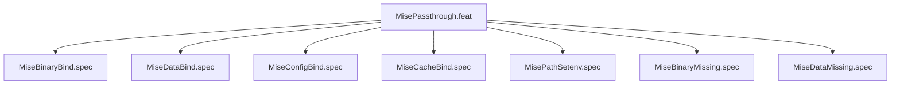

# MisePassthrough

## Goal

Bind mise toolchain (binary, data, config, cache, PATH shims) into sandbox

## Feature Tree

## Specifications

| Spec | Given | When | Then |
|------|-------|------|------|
| MiseBinaryBind | Given sandbox configured | When dry-run | Then MiseBinaryBind verified |
| MiseDataBind | Given sandbox configured | When dry-run | Then MiseDataBind verified |
| MiseConfigBind | Given sandbox configured | When dry-run | Then MiseConfigBind verified |
| MiseCacheBind | Given sandbox configured | When dry-run | Then MiseCacheBind verified |
| MisePathSetenv | Given sandbox configured | When dry-run | Then MisePathSetenv verified |
| MiseBinaryMissing | Given sandbox configured | When dry-run | Then MiseBinaryMissing verified |
| MiseDataMissing | Given sandbox configured | When dry-run | Then MiseDataMissing verified |

## Test Suite

All tests in `src/test/hanaden-bwrap-enhanced/suites/MisePassthrough.feat/` -- bats-core.

## Changelog

| Version | Date | Author | Changes |
|---------|------|--------|---------|
| 0.3.0 | 2026-08-30 | Frederick Bloom + AI | Initial with mermaid, GWT, full template |
