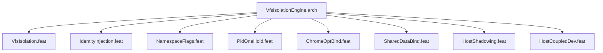

# VfsIsolationEngine

## Purpose
Constructs the virtual filesystem: root pivot, tmpfs overlays, identity injection,
home egress, shared data binds, kernel filesystems, TLS certificates.

## Feature Tree

## Changelog

| Version | Date | Author | Changes |
|---------|------|--------|---------|
| 0.3.0 | 2026-08-30 | Frederick Bloom + AI | Initial |
