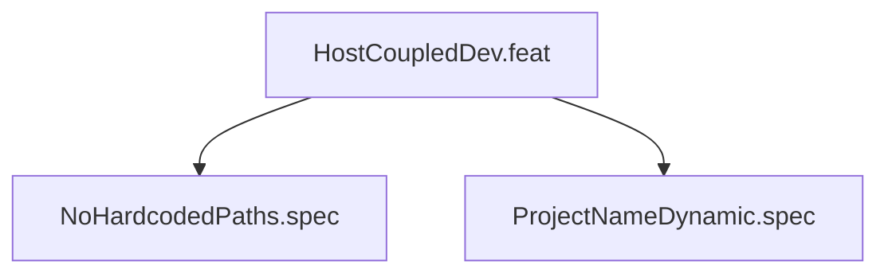

# HostCoupledDev

## Goal
Script and tests are portable across Linux hosts; no hardcoded host-specific paths.

## Feature Tree

## Changelog
| Version | Date | Author | Changes |
|---------|------|--------|---------|
| 0.3.0 | 2026-08-30 | Frederick Bloom + AI | Initial |
