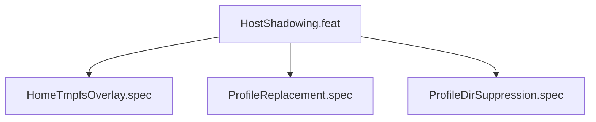

# HostShadowing
## Goal
Verify that sandbox construction shadows host paths with ephemeral layers.

```mermaid
graph TD
    HS["HostShadowing.feat"]
    HT["HomeTmpfsOverlay.spec"]
    PR["ProfileReplacement.spec"]
    PD["ProfileDirSuppression.spec"]
    HS --> HT & PR & PD
```
