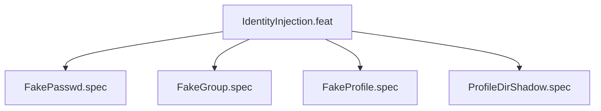

# IdentityInjection

## Goal

Create synthetic /etc/passwd, /etc/group, /etc/profile inside sandbox
via file-descriptor injection (--ro-bind-data FD). Prevents identity
leakage from host while providing usable user environment.

## Feature Tree

## Specifications

| Spec | Given | When | Then |
|------|-------|------|------|
| FakePasswd | Default config | dry-run | --ro-bind-data 9 /etc/passwd present |
| FakeGroup | Default config | dry-run | --ro-bind-data 10 /etc/group present |
| FakeProfile | Default config | dry-run | --ro-bind-data 11 /etc/profile present |
| ProfileDirShadow | Default config | dry-run | --tmpfs /etc/profile.d present |

## Test Suite

All tests in `src/test/hanaden-bwrap-enhanced/suites/IdentityInjection.feat/` -- bats-core.

## Changelog

| Version | Date | Author | Changes |
|---------|------|--------|---------|
| 0.3.0 | 2026-08-30 | Frederick Bloom + AI | Initial with mermaid, GWT, full template |
