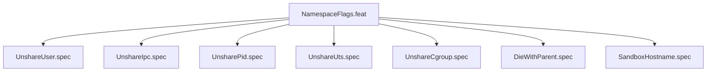

# NamespaceFlags

## Goal
Ensure every bwrap invocation unshares all five Linux namespace types
plus sets die-with-parent and a fixed hostname. These are never optional.

## Specs
- UnshareUser: --unshare-user always present
- UnshareIpc: --unshare-ipc always present
- UnsharePid: --unshare-pid always present
- UnshareUts: --unshare-uts always present
- UnshareCgroup: --unshare-cgroup always present
- DieWithParent: --die-with-parent always present
- SandboxHostname: --hostname sandbox-vfs always present

## Changelog

| Version | Date | Author | Changes |
|---------|------|--------|---------|
| 0.3.0 | 2026-08-30 | Frederick Bloom + AI | Initial |
