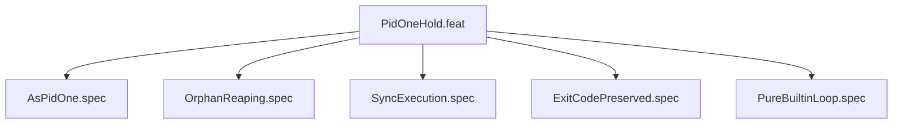

# PidOneHold

## Goal

PID 1 hold pattern with orphan reaping and exit code preservation

## Feature Tree

## Specifications

| Spec | Given | When | Then |
|------|-------|------|------|
| AsPidOne | Given sandbox configured | When dry-run | Then AsPidOne verified |
| OrphanReaping | Given sandbox configured | When dry-run | Then OrphanReaping verified |
| SyncExecution | Given sandbox configured | When dry-run | Then SyncExecution verified |
| ExitCodePreserved | Given sandbox configured | When dry-run | Then ExitCodePreserved verified |
| PureBuiltinLoop | Given sandbox configured | When dry-run | Then PureBuiltinLoop verified |

## Test Suite

All tests in `src/test/hanaden-bwrap-enhanced/suites/PidOneHold.feat/` -- bats-core.

## Changelog

| Version | Date | Author | Changes |
|---------|------|--------|---------|
| 0.3.0 | 2026-08-30 | Frederick Bloom + AI | Initial with mermaid, GWT, full template |
