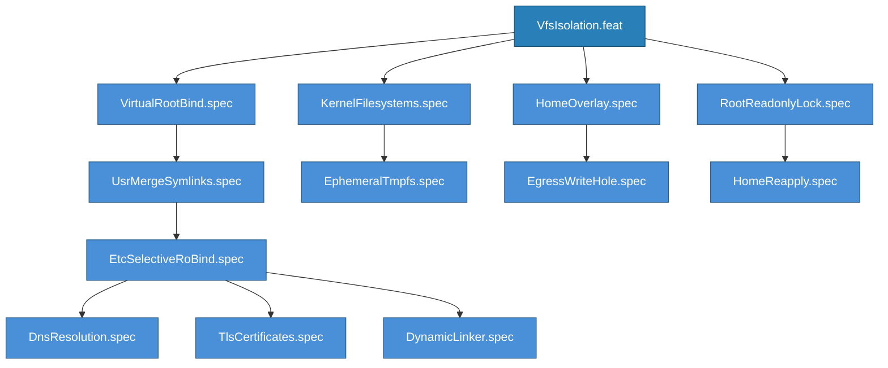

<!-- (c) 2026-* Frederick Bloom -- VfsIsolation.feat -- Hanaden AI Loader -->
---
filename-id:   20260830-033239-278331-7372-854d-46b444fcc7f0-VfsIsolation.feat
node-type:     FEAT
layer:         2
version:       0.3.0
status:        Draft
author:        Frederick Bloom
copyright:     (c) 2026-* Frederick Bloom
description: >
  Feature: Virtual Filesystem Isolation. The sandbox presents a clean, isolated
  Linux environment constructed from: bind-mounted virtual root, usr-merge
  symlinks, selective /etc binds, kernel filesystems, ephemeral tmpfs mounts,
  home overlay with write-hole, and root read-only lock.
parent:        20260830-025421-832855-7d64-9403-b6d0df1e9bc5-VfsIsolationEngine.arch
tdd:
  state:          GREEN
  test-file:      src/test/hanaden-bwrap-enhanced/suites/VfsIsolation.feat/
---

# VfsIsolation: Core Sandbox Filesystem Construction

## Spec Tree

## Changelog

| Version | Date | Author | Changes |
|---------|------|--------|---------|
| 0.3.0 | 2026-08-30 | Frederick Bloom + AI | Initial |
