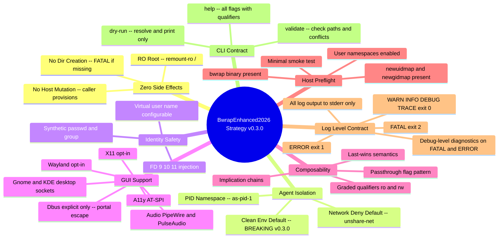
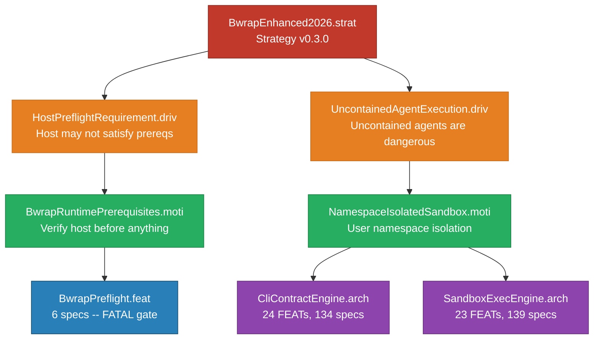

<!-- (c) 2026-* Frederick Bloom -- 20260830-024933-915943-7f3d-8daa-c7c4b56bcb0d-BwrapEnhanced2026.strat-0.3.0.md -- Hanaden AI Loader -->
---
filename-id:   20260830-024933-915943-7f3d-8daa-c7c4b56bcb0d-BwrapEnhanced2026.strat
node-type:     STRAT
layer:         0
version:       0.3.0
status:        Active
author:        Frederick Bloom
copyright:     (c) 2026-* Frederick Bloom
description: >
  Strategy: Provide a production-grade, zero-side-effect sandbox for AI agent
  execution via Linux user-namespace bubblewrap (bwrap) with a comprehensive CLI.
  v0.3.0 introduces clean-env-by-default (BREAKING), --*-passthrough flag naming,
  graded qualifiers (ro|rw), implication chains, host preflight validation, and
  log-level contract with graded exit codes.
---

# BwrapEnhanced2026: Strategy (v0.3.0)

## Rationale

AI agents (LLMs, agentic loops, code interpreters) are fundamentally untrusted
workloads. They may generate and execute arbitrary shell commands, touch files,
consume credentials, exfiltrate data, or corrupt system state. Running them on
bare metal or in a simple `bash -c` subshell creates unacceptable production risk.

The strategy is to provide a single, composable, zero-dependency sandbox harness
(`bwrap-enhanced.sh`) that any AI orchestrator can call as a drop-in subprocess
boundary. The harness must be:

- Zero-mutation to the host (read-only root, no dir creation)
- Zero-network by default (--unshare-net)
- Zero-credential-leak (clean env by default -- BREAKING in v0.3.0)
- Zero-identity-confusion (synthetic identity files via FD injection)
- Composable (--*-passthrough flags with last-wins semantics)
- Self-diagnosing (host preflight, FATAL/ERROR/DEBUG log contract)

## Strategic Goals

## Decomposition

This strategy decomposes into two independent driver branches:

### DRIV 1: HostPreflightRequirement.driv (NEW in v0.3.0)

The host may not satisfy kernel or binary prerequisites. A missing bwrap binary,
absent newuidmap/newgidmap, or disabled user namespaces makes the entire strategy
impossible. No CLI flag can rescue this -- it is a hard prerequisite that
invalidates the strategy.

- MOTI: BwrapRuntimePrerequisites.moti
- FEAT: BwrapPreflight.feat (6 specs; all FATAL exit 2; no rescue flag)

### DRIV 2: UncontainedAgentExecution.driv (carry forward, updated)

Uncontained AI agent execution creates unacceptable production risk. Agents may
generate arbitrary shell commands, touch files, consume credentials, exfiltrate
data, or corrupt system state.

- MOTI: NamespaceIsolatedSandbox.moti
  - ARCH 1: CliContractEngine.arch (parsing, validation, dry-run)
    - 24 FEATs, 134 specs
  - ARCH 2: SandboxExecEngine.arch (exec_sandbox, VFS, identity, GUI)
    - 23 FEATs, 139 specs

### Hierarchy Diagram

Total: 279 specs across 48 FEATs, 2 ARCHs, 2 MOTIs, 2 DRIVs, 1 STRAT.

## v0.3.0 Breaking Changes

| Change | v0.2.x Behavior | v0.3.0 Behavior |
|--------|-----------------|-----------------|
| Clean env | Opt-in via --clear-env | Default; opt-out via --env-passthrough |
| Flag naming | --enable-*, --clear-env, --share-net | --*-passthrough pattern throughout |
| Graded flags | N/A | --mise-passthrough ro or rw, --local-bin-passthrough ro or rw |
| Host preflight | None (silent failure) | FATAL exit 2 if bwrap/newuidmap/user-ns absent |
| Provision flag | N/A | --provision-virtual-root-if-needed true or false(default) |
| Log level | Ad hoc echo/printf | Structured log contract with graded exit codes |
| Implication chains | N/A | wayland/gnome/kde imply x11=true automatically |
| Dry run | N/A | --dry-run resolves flags, prints argv, exit 0 |
| Validate | N/A | --validate checks paths + conflicts, exit 0 or 1 |

## Changelog

| Version | Date | Author | Changes |
|---------|------|--------|---------|
| 0.0.1 | 2026-08-16 | Frederick Bloom + AI | Initial |
| 0.0.1 | 2026-08-17 | Frederick Bloom + AI | Enriched: Rationale, Mermaid mindmap |
| 0.3.0 | 2026-08-30 | Frederick Bloom + AI | Full redesign from SCOPE-very-narrow.md; two-DRIV split; 279 specs |
