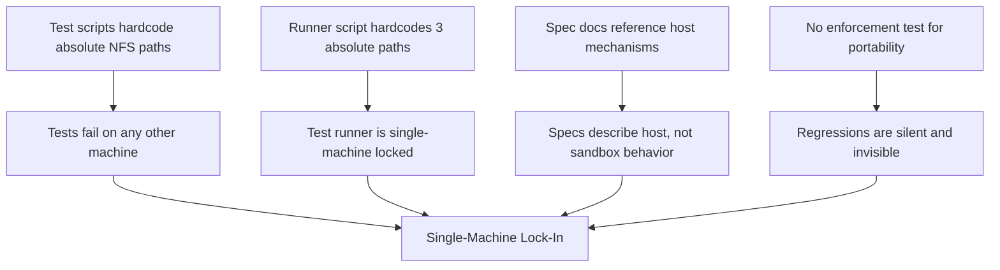

<!-- (c) 2026-* Frederick Bloom -- 20260827-000058-027168-7574-a819-257ba7f3d69e-HostCoupledDevelopment.driv-0.0.1.md -- Hanaden AI -->
---
filename-id:   20260827-000058-027168-7574-a819-257ba7f3d69e-HostCoupledDevelopment.driv-0.0.1
node-type:     DRIV
layer:         1
version:       0.0.1
status:        Active
author:        Frederick Bloom
copyright:     (c) 2026-* Frederick Bloom
description: >
  Driver: Project source, tests, and spec documents contain hardcoded
  absolute paths to host-specific filesystem topology, coupling the
  project to a single development workstation.
---

# HostCoupledDevelopment: Driver (Deficit)

## Problem Statement

The project's source code, test scripts, and specification documents contain
references to host-specific filesystem topology -- absolute NFS paths, autofs
mount points, and user account directory names. This couples the project to
a single development workstation, preventing:

- **Cloning:** project fails on any other machine
- **CI/CD:** automated builds and tests are impossible
- **Collaboration:** no other developer can contribute
- **Disaster recovery:** losing the workstation means losing the ability to test

## Root Cause Analysis

## Ontological Tests

- **Removal Test:** If NamespaceIsolatedSandbox is removed, the hardcoded paths
  still break portability. The deficit persists independently. PASS.
- **Direction Test:** HostCoupledDevelopment is a deficit (problem). It exists
  without any motivator. PASS.

## Decomposition

- **Motivation:** PortableProjectStructure.moti
