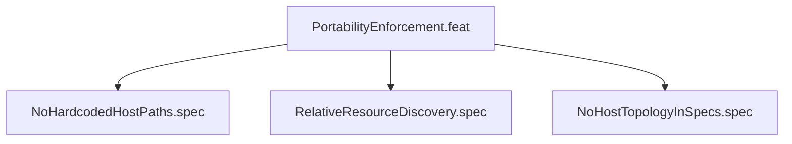

<!-- (c) 2026-* Frederick Bloom -- 20260827-000058-047623-715e-acf7-c33b0f61398a-PortabilityEnforcement.feat-0.0.1.md -- Hanaden AI -->
---
filename-id:   20260827-000058-047623-715e-acf7-c33b0f61398a-PortabilityEnforcement.feat-0.0.1
node-type:     FEAT
layer:         2
version:       0.0.1
status:        Draft
author:        Frederick Bloom
copyright:     (c) 2026-* Frederick Bloom
description: >
  Feature: Automated enforcement of portability constraints across source,
  test, and specification files. Three specs enforce the zero-hardcoded-paths,
  relative-discovery, and topology-free-specs invariants.
parent:        20260827-000058-037414-72c3-97e6-c71ad41d483b-PortableProjectStructure.moti-0.0.1
tdd:
  state:         IN_PROGRESS
  test-file:     null
  last-run:      null
  iterations:    0
---

# PortabilityEnforcement: Feature

## Description

Automated enforcement of portability constraints. Three specs ensure that the
project remains free of host-specific coupling:

1. **NoHardcodedHostPaths** -- source files contain zero host-specific absolute paths
2. **RelativeResourceDiscovery** -- scripts locate resources relative to themselves
3. **NoHostTopologyInSpecs** -- spec docs describe behavior, not host mechanisms

All specs are language-agnostic behavioral contracts. The enforcement tests may
be implemented in any language; the current implementation uses bash.

## Decomposition

## Specs

- NoHardcodedHostPaths.spec -- grep scan for prohibited absolute paths
- RelativeResourceDiscovery.spec -- scripts must self-locate, not use absolute paths
- NoHostTopologyInSpecs.spec -- specs describe behavior, not host mechanisms
