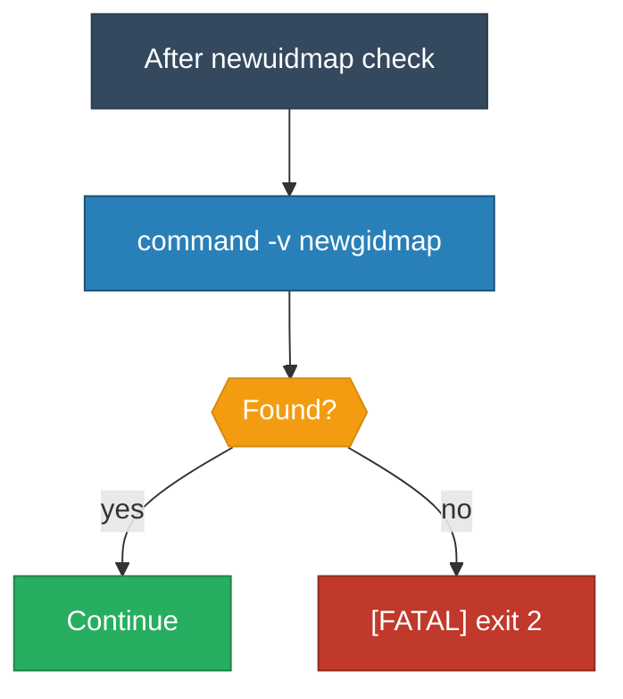

<!-- (c) 2026-* Frederick Bloom -- 20260830-030811-553655-773b-814b-b182f342e423-NewgidmapPresent.spec-0.3.0.md -- Hanaden AI Loader -->
---
filename-id:   20260830-030811-553655-773b-814b-b182f342e423-NewgidmapPresent.spec
node-type:     SPEC
layer:         4
version:       0.3.0
status:        Draft
author:        Frederick Bloom
copyright:     (c) 2026-* Frederick Bloom
description: >
  Specification: newgidmap binary MUST be present on PATH. Required for bwrap
  user namespace GID mapping. FATAL exit 2 with diagnostic if absent.
parent:        20260830-025804-340827-7502-bcf6-22d32f370f3a-BwrapPreflight.feat
spec-domain:   preflight
leaf-value:    binary-present
leaf-unit:     boolean
tdd:
  state:          RED
  test-file:      src/test/hanaden-bwrap-enhanced/suites/BwrapPreflight.feat/NewgidmapPresent.spec/test_newgidmap_present.bats
---

# NewgidmapPresent: newgidmap binary MUST be on PATH

## Specification Statement

During preflight, the script MUST verify `command -v newgidmap`. If NOT found:
1. Emit `[FATAL] newgidmap binary not found on PATH` to stderr
2. Emit `[DIAG]  command -v newgidmap returned non-zero` to stderr
3. Emit `[HINT]  Install: apt install uidmap  OR  dnf install shadow-utils` to stderr
4. Exit with code 2

## Constraints

| Constraint | Value |
|------------|-------|
| Exit code | 2 |
| Output channel | stderr |
| Check method | command -v |
| Timing | Before parse_args() |

## Behavioral Flow

## Test Suite

| ID | Description | Pass Criteria | TDD |
|----|-------------|---------------|-----|
| PF-GID-001 | newgidmap present | exit != 2 | RED |
| PF-GID-002 | newgidmap absent | exit 2 | RED |
| PF-GID-003 | newgidmap absent | stderr contains [FATAL] | RED |
| PF-GID-004 | newgidmap absent | stderr contains uidmap | RED |

## Changelog

| Version | Date | Author | Changes |
|---------|------|--------|---------|
| 0.3.0 | 2026-08-30 | Frederick Bloom + AI | Initial |
