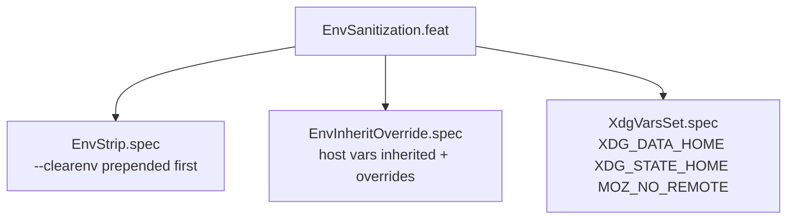

<!-- (c) 2026-* Frederick Bloom -- EnvSanitization.feat-0.0.1.md -- Hanaden AI Loader -->
---
filename-id:   20260816-182145-EnvSanitization.feat
node-type:     FEAT
layer:         2
version:       0.0.1
status:        Implemented
author:        Frederick Bloom
copyright:     (c) 2026-* Frederick Bloom
parent:        20260816-182145-NamespaceIsolatedSandbox.moti
description: >
  Feature: --clear-env strips all host vars via --clearenv (prepended first).
  Explicit --setenv for HOME, USER, PATH, XDG_DATA_HOME, XDG_STATE_HOME, MOZ_NO_REMOTE.
  TERM explicitly unset. Without --clear-env, host vars inherited with identity overrides.
---

# EnvSanitization: Host Env Stripped or Overridden

## Rationale

AI orchestrators carry sensitive credentials in environment variables. `--clearenv`
followed by explicit `--setenv` injections is the only reliable way to guarantee
no credential leakage into the sandbox.

## Feature Overview

## Changelog

| Version | Date | Author | Changes |
|---------|------|--------|---------|
| 0.0.1 | 2026-08-16 | Frederick Bloom + AI | Initial |
| 0.0.1 | 2026-08-17 | Frederick Bloom + AI | Enriched |
