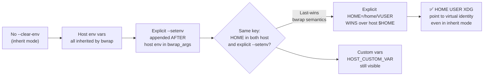

<!-- (c) 2026-* Frederick Bloom -- 20260816-182145-367456-7191-82bf-a0750eb57850-EnvInheritOverride.spec-0.0.1.md -- Hanaden AI Loader -->
---
filename-id:   20260816-182145-367456-7191-82bf-a0750eb57850-EnvInheritOverride.spec
node-type:     SPEC
layer:         4
spec-domain:   FUNC
version:       0.0.1
status:        Implemented
author:        Frederick Bloom
copyright:     (c) 2026-* Frederick Bloom
description: >
  Without --clear-env, the sandbox inherits all host environment variables.
  Explicit --setenv injections for HOME, USER, PATH, XDG_DATA_HOME, XDG_STATE_HOME
  override inherited values via bwrap's last-occurrence-wins semantics. TERM is
  inherited from the host terminal.
parent:        20260816-101335-229795-bd24-f66d-e833628900cd-EnvSanitization.feat
leaf-value:    "host vars inherited; explicit --setenv overrides win (last-wins)"
leaf-unit:     "override count"
tdd:
  state:          PASS
  test-file:      src/test/hanaden-bwrap-enhanced/BwrapEnhanced2026.strat/UncontainedAgentExecution.driv/NamespaceIsolatedSandbox.moti/EnvSanitization.feat/EnvInheritOverride.spec/test_env_inherit_override.sh
  last-run:       2026-08-18T16:08:59Z
  iterations:     1
  coverage-lines: "L348-L360"
---

# EnvInheritOverride: Host Vars Inherited, Explicit --setenv Values Override

## Specification Statement

Without `--clear-env`, all host environment variables MUST be visible inside the
sandbox. Explicit `--setenv` calls for `HOME`, `USER`, `PATH`, `XDG_DATA_HOME`,
`XDG_STATE_HOME` MUST override their host values via bwrap's last-occurrence-wins
semantics.

## Rationale

Some workloads need host tooling (conda, nvm, pyenv) pre-configured in the environment.
Stripping all vars would break these. The inherit mode allows these tools to remain
configured while still enforcing the sandbox identity vars (HOME, USER, XDG).

The critical invariant: HOME and USER MUST point to the sandbox virtual identity even
in inherit mode. If they were inherited from the host, the agent would write to the
operator's real home directory, violating the egress contract. The explicit --setenv
calls placed after all inherited vars (by bwrap's arg ordering) override these.

## Constraints

| Constraint | Value | Condition |
|------------|-------|-----------|
| Host vars visible | yes | Without --clear-env |
| HOME value inside | /home/VUSER (not host $HOME) | Always |
| USER value inside | VIRTUAL_USER_NAME | Always |
| TERM visible inside | inherited from host | Without --clear-env |
| Override mechanism | --setenv (last-wins in bwrap) | Always |

## Leaf Value

> 🛑 **Primitive** — terminal specification.

**Value:** Host vars inherited; `HOME`/`USER`/`XDG_*` overrides win
**Source:** bwrap-enhanced.sh L348-L360 (--setenv injections, no --clearenv)

## Measurement Method

```bash
# Set a custom host var:
export HOST_CUSTOM_VAR="hello-from-host"
./bwrap-enhanced.sh ... -- bash -c 'echo $HOST_CUSTOM_VAR'
# Expected: hello-from-host  (inherited)

# Verify HOME override:
./bwrap-enhanced.sh ... -- bash -c 'echo $HOME'
# Expected: /home/VUSER  (not the host $HOME)

# Verify TERM is inherited:
echo "HOST TERM: $TERM"
./bwrap-enhanced.sh ... -- bash -c 'echo "SANDBOX TERM: $TERM"'
# Expected: SANDBOX TERM matches HOST TERM
```

## Test Suite

> **Suite ID:** 20260816-182145-367456-7191-82bf-a0750eb57850-EnvInheritOverride.spec-SUITE

### ⚙️ Functional Tests

| ID | Description | Method | Pass Criteria | TDD |
|----|-------------|--------|---------------|-----|
| EIO-001 | Host custom var visible inside | `HOST_VAR=x env` inside (no --clear-env) | HOST_VAR=x | NOT_STARTED |
| EIO-002 | HOME is overridden to /home/VUSER | `echo $HOME` inside | /home/VUSER | NOT_STARTED |
| EIO-003 | USER is overridden to VUSER | `echo $USER` inside | VIRTUAL_USER_NAME | NOT_STARTED |
| EIO-004 | TERM is inherited from host | `echo $TERM` inside | xterm-256color or similar | NOT_STARTED |
| EIO-005 | XDG_DATA_HOME is overridden | `echo $XDG_DATA_HOME` inside | /home/VUSER/.local/share | NOT_STARTED |

## References

- bwrap-enhanced.sh L348-L360 (--setenv HOME/USER/PATH/XDG_DATA_HOME/XDG_STATE_HOME without --clearenv)

## Changelog

| Version | Date | Author | Changes |
|---------|------|--------|---------|
| 0.0.1 | 2026-08-16 | Frederick Bloom + AI | Initial spec |
| 0.0.1 | 2026-08-17 | Frederick Bloom + AI | Enrich: Rationale, Measurement Method, Leaf Value |

## Behavioral Flow


